<!-- GENERATED:MODEL -->
---
tags: [odoo, community, generated, model]
---

# im_livechat.channel.rule

- Module: [[docs/Community Addons/im_livechat/im_livechat|im_livechat]]
- Scope: Community Addons
- Defined in module: yes
- Source files: `models/im_livechat_channel.py`
- Python classes: `Im_LivechatChannelRule`
- Description: Livechat Channel Rules

## Field footprint

- Detected fields: 8
- Field types: `Char` x 1, `Integer` x 2, `Many2many` x 1, `Many2one` x 2, `Selection` x 2
- Relation fields: 3

## Sample fields

- `action`: `Selection`
- `auto_popup_timer`: `Integer` (comodel `Time to Open`)
- `channel_id`: `Many2one` (comodel `im_livechat.channel`)
- `chatbot_enabled_condition`: `Selection`
- `chatbot_script_id`: `Many2one` (comodel `chatbot.script`)
- `country_ids`: `Many2many` (comodel `res.country`)
- `regex_url`: `Char` (comodel `URL Regex`)
- `sequence`: `Integer` (comodel `Matching order`)

## Method hints

- Detected methods: 3
- Action methods: none
- Compute methods: none
- Onchange methods: none

## Direct relation diagram

```plantuml
@startuml
!define ODOO_COLOR_PRIMARY #714B67
!define ODOO_COLOR_ACCENT #875A7B
!define ODOO_COLOR_BG #FAF7FA

skinparam backgroundColor ODOO_COLOR_BG
skinparam defaultTextAlignment left
skinparam ArrowColor ODOO_COLOR_ACCENT
skinparam ClassBackgroundColor white
skinparam ClassBorderColor ODOO_COLOR_PRIMARY
skinparam ComponentBackgroundColor white
skinparam ComponentBorderColor ODOO_COLOR_PRIMARY
skinparam NoteBackgroundColor #FFF8FF
skinparam NoteBorderColor ODOO_COLOR_ACCENT
skinparam SequenceLifeLineBorderColor ODOO_COLOR_ACCENT
skinparam SequenceLifeLineBackgroundColor #FFFFFF
skinparam SequenceParticipantBorderColor ODOO_COLOR_PRIMARY
skinparam SequenceParticipantBackgroundColor #FFFFFF
skinparam sequence {
  ArrowColor ODOO_COLOR_ACCENT
  ActorBorderColor ODOO_COLOR_PRIMARY
}
title im_livechat.channel.rule - Direct Relations
class "im_livechat.channel.rule" as im_livechat_channel_rule
class "chatbot.script" as chatbot_script
class "im_livechat.channel" as im_livechat_channel
class "res.country" as res_country
im_livechat_channel_rule --> chatbot_script : chatbot_script_id
im_livechat_channel_rule --> im_livechat_channel : channel_id
im_livechat_channel_rule .. res_country : country_ids
@enduml
```

## Navigation

- **Parent:** [[docs/Community Addons/im_livechat/Models]]

<!-- GENERATED:MODEL -->
