<!-- GENERATED:MODEL -->
---
tags: [odoo, community, generated, model]
---

# im_livechat.conversation.tag

- Module: [[docs/Community Addons/im_livechat/im_livechat|im_livechat]]
- Scope: Community Addons
- Defined in module: yes
- Source files: `models/im_livechat_conversation_tag.py`
- Python classes: `Im_LivechatConversationTag`
- Description: Live Chat Conversation Tags

## Field footprint

- Detected fields: 3
- Field types: `Char` x 1, `Integer` x 1, `Many2many` x 1
- Relation fields: 1

## Sample fields

- `color`: `Integer` (comodel `Color`)
- `conversation_ids`: `Many2many` (comodel `discuss.channel`)
- `name`: `Char` (comodel `Name`)

## Method hints

- Detected methods: 2
- Action methods: none
- Compute methods: none
- Onchange methods: none

## Direct relation diagram

```plantuml
@startuml
!define ODOO_COLOR_PRIMARY #714B67
!define ODOO_COLOR_ACCENT #875A7B
!define ODOO_COLOR_BG #FAF7FA

skinparam backgroundColor ODOO_COLOR_BG
skinparam defaultTextAlignment left
skinparam ArrowColor ODOO_COLOR_ACCENT
skinparam ClassBackgroundColor white
skinparam ClassBorderColor ODOO_COLOR_PRIMARY
skinparam ComponentBackgroundColor white
skinparam ComponentBorderColor ODOO_COLOR_PRIMARY
skinparam NoteBackgroundColor #FFF8FF
skinparam NoteBorderColor ODOO_COLOR_ACCENT
skinparam SequenceLifeLineBorderColor ODOO_COLOR_ACCENT
skinparam SequenceLifeLineBackgroundColor #FFFFFF
skinparam SequenceParticipantBorderColor ODOO_COLOR_PRIMARY
skinparam SequenceParticipantBackgroundColor #FFFFFF
skinparam sequence {
  ArrowColor ODOO_COLOR_ACCENT
  ActorBorderColor ODOO_COLOR_PRIMARY
}
title im_livechat.conversation.tag - Direct Relations
class "im_livechat.conversation.tag" as im_livechat_conversation_tag
class "discuss.channel" as discuss_channel
im_livechat_conversation_tag .. discuss_channel : conversation_ids
@enduml
```

## Navigation

- **Parent:** [[docs/Community Addons/im_livechat/Models]]

<!-- GENERATED:MODEL -->
