<!-- GENERATED:MODEL -->
---
tags: [odoo, community, generated, model]
---

# im_livechat.report.channel

- Module: [[docs/Community Addons/im_livechat/im_livechat|im_livechat]]
- Scope: Community Addons
- Defined in module: yes
- Source files: `report/im_livechat_report_channel.py`
- Python classes: `Im_LivechatReportChannel`
- Description: Livechat Support Channel Report

## Field footprint

- Detected fields: 33
- Field types: `Char` x 9, `Datetime` x 1, `Float` x 6, `Integer` x 4, `Many2many` x 2, `Many2one` x 9, `Selection` x 2
- Relation fields: 11

## Sample fields

- `agent_providing_help_history`: `Many2one` (comodel `im_livechat.channel.member.history`, related `channel_id.livechat_agent_providing_help_history`)
- `agent_requesting_help_history`: `Many2one` (comodel `im_livechat.channel.member.history`, related `channel_id.livechat_agent_requesting_help_history`)
- `call_duration_hour`: `Float` (comodel `Call Duration`)
- `channel_id`: `Many2one` (comodel `discuss.channel`)
- `channel_name`: `Char` (comodel `Channel Name`)
- `chatbot_answers_path`: `Char` (comodel `Chatbot Answers`)
- `chatbot_answers_path_str`: `Char` (comodel `Chatbot Answers (String)`)
- `chatbot_script_id`: `Many2one` (comodel `chatbot.script`)
- `conversation_tag_ids`: `Many2many` (comodel `im_livechat.conversation.tag`, related `channel_id.livechat_conversation_tag_ids`)
- `country_id`: `Many2one` (comodel `res.country`)
- `day_number`: `Selection`
- `duration`: `Float` (comodel `Duration (min)`)
- `handled_by_agent`: `Integer` (comodel `Handled by Agent`)
- `handled_by_bot`: `Integer` (comodel `Handled by Bot`)
- `has_call`: `Float` (comodel `Whether the session had a call`)
- `lang_id`: `Many2one` (comodel `res.lang`, related `channel_id.livechat_lang_id`)
- `livechat_channel_id`: `Many2one` (comodel `im_livechat.channel`)
- `nbr_message`: `Integer` (comodel `Messages per Session`)
- `number_of_calls`: `Float` (comodel `# of Sessions with calls`, related `has_call`)
- `partner_id`: `Many2one` (comodel `res.partner`)

## Method hints

- Detected methods: 7
- Action methods: `action_open_discuss_channel_view`
- Compute methods: none
- Onchange methods: none

## Direct relation diagram

```plantuml
@startuml
!define ODOO_COLOR_PRIMARY #714B67
!define ODOO_COLOR_ACCENT #875A7B
!define ODOO_COLOR_BG #FAF7FA

skinparam backgroundColor ODOO_COLOR_BG
skinparam defaultTextAlignment left
skinparam ArrowColor ODOO_COLOR_ACCENT
skinparam ClassBackgroundColor white
skinparam ClassBorderColor ODOO_COLOR_PRIMARY
skinparam ComponentBackgroundColor white
skinparam ComponentBorderColor ODOO_COLOR_PRIMARY
skinparam NoteBackgroundColor #FFF8FF
skinparam NoteBorderColor ODOO_COLOR_ACCENT
skinparam SequenceLifeLineBorderColor ODOO_COLOR_ACCENT
skinparam SequenceLifeLineBackgroundColor #FFFFFF
skinparam SequenceParticipantBorderColor ODOO_COLOR_PRIMARY
skinparam SequenceParticipantBackgroundColor #FFFFFF
skinparam sequence {
  ArrowColor ODOO_COLOR_ACCENT
  ActorBorderColor ODOO_COLOR_PRIMARY
}
title im_livechat.report.channel - Direct Relations
class "im_livechat.report.channel" as im_livechat_report_channel
class "chatbot.script" as chatbot_script
class "discuss.channel" as discuss_channel
class "im_livechat.channel" as im_livechat_channel
class "im_livechat.channel.member.history" as im_livechat_channel_member_history
class "im_livechat.conversation.tag" as im_livechat_conversation_tag
class "im_livechat.expertise" as im_livechat_expertise
class "res.country" as res_country
class "res.lang" as res_lang
class "res.partner" as res_partner
im_livechat_report_channel --> discuss_channel : channel_id
im_livechat_report_channel --> im_livechat_channel : livechat_channel_id
im_livechat_report_channel --> res_country : country_id
im_livechat_report_channel --> res_lang : lang_id
im_livechat_report_channel --> res_partner : partner_id
im_livechat_report_channel --> res_partner : visitor_partner_id
im_livechat_report_channel --> chatbot_script : chatbot_script_id
im_livechat_report_channel .. im_livechat_expertise : session_expertise_ids
im_livechat_report_channel .. im_livechat_conversation_tag : conversation_tag_ids
im_livechat_report_channel --> im_livechat_channel_member_history : agent_requesting_help_history
im_livechat_report_channel --> im_livechat_channel_member_history : agent_providing_help_history
@enduml
```

## Navigation

- **Parent:** [[docs/Community Addons/im_livechat/Models]]

<!-- GENERATED:MODEL -->
