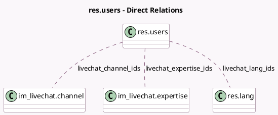

<!-- GENERATED:MODEL -->
---
tags: [odoo, community, generated, model]
---

# res.users

- Module: [[docs/Community Addons/im_livechat/im_livechat|im_livechat]]
- Scope: Community Addons
- Defined in module: extension only
- Source files: `models/res_users.py`
- Python classes: `ResUsers`

## Field footprint

- Detected fields: 7
- Field types: `Boolean` x 2, `Char` x 1, `Integer` x 1, `Many2many` x 3
- Relation fields: 3

## Sample fields

- `has_access_livechat`: `Boolean` (compute `_compute_has_access_livechat`, store `False`)
- `livechat_channel_ids`: `Many2many` (comodel `im_livechat.channel`)
- `livechat_expertise_ids`: `Many2many` (comodel `im_livechat.expertise`, compute `_compute_livechat_expertise_ids`, store `False`)
- `livechat_is_in_call`: `Boolean` (compute `_compute_livechat_is_in_call`)
- `livechat_lang_ids`: `Many2many` (comodel `res.lang`, compute `_compute_livechat_lang_ids`, store `False`)
- `livechat_ongoing_session_count`: `Integer` (comodel `Number of Ongoing sessions`, compute `_compute_livechat_ongoing_session_count`)
- `livechat_username`: `Char` (compute `_compute_livechat_username`, store `False`)

## Method hints

- Detected methods: 13
- Action methods: none
- Compute methods: `_compute_has_access_livechat`, `_compute_livechat_expertise_ids`, `_compute_livechat_is_in_call`, `_compute_livechat_lang_ids`, `_compute_livechat_ongoing_session_count`, `_compute_livechat_username`
- Onchange methods: none

## Direct relation diagram

## Navigation

- **Parent:** [[docs/Community Addons/im_livechat/Models]]

<!-- GENERATED:MODEL -->
