<!-- GENERATED:MODEL -->
---
tags: [odoo, community, generated, model]
---

# res.users.settings

- Module: [[docs/Community Addons/im_livechat/im_livechat|im_livechat]]
- Scope: Community Addons
- Defined in module: extension only
- Source files: `models/res_users_settings.py`
- Python classes: `ResUsersSettings`

## Field footprint

- Detected fields: 3
- Field types: `Char` x 1, `Many2many` x 2
- Relation fields: 2

## Sample fields

- `livechat_expertise_ids`: `Many2many` (comodel `im_livechat.expertise`)
- `livechat_lang_ids`: `Many2many` (comodel `res.lang`)
- `livechat_username`: `Char` (comodel `Livechat Username`)

## Method hints

- Detected methods: 0
- Action methods: none
- Compute methods: none
- Onchange methods: none

## Direct relation diagram

```plantuml
@startuml
!define ODOO_COLOR_PRIMARY #714B67
!define ODOO_COLOR_ACCENT #875A7B
!define ODOO_COLOR_BG #FAF7FA

skinparam backgroundColor ODOO_COLOR_BG
skinparam defaultTextAlignment left
skinparam ArrowColor ODOO_COLOR_ACCENT
skinparam ClassBackgroundColor white
skinparam ClassBorderColor ODOO_COLOR_PRIMARY
skinparam ComponentBackgroundColor white
skinparam ComponentBorderColor ODOO_COLOR_PRIMARY
skinparam NoteBackgroundColor #FFF8FF
skinparam NoteBorderColor ODOO_COLOR_ACCENT
skinparam SequenceLifeLineBorderColor ODOO_COLOR_ACCENT
skinparam SequenceLifeLineBackgroundColor #FFFFFF
skinparam SequenceParticipantBorderColor ODOO_COLOR_PRIMARY
skinparam SequenceParticipantBackgroundColor #FFFFFF
skinparam sequence {
  ArrowColor ODOO_COLOR_ACCENT
  ActorBorderColor ODOO_COLOR_PRIMARY
}
title res.users.settings - Direct Relations
class "res.users.settings" as res_users_settings
class "im_livechat.expertise" as im_livechat_expertise
class "res.lang" as res_lang
res_users_settings .. res_lang : livechat_lang_ids
res_users_settings .. im_livechat_expertise : livechat_expertise_ids
@enduml
```

## Navigation

- **Parent:** [[docs/Community Addons/im_livechat/Models]]

<!-- GENERATED:MODEL -->
