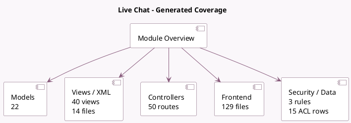

<!-- GENERATED:MODULE -->
---
tags: [odoo, community, module]
---

# Live Chat

- Scope: Community Addons
- Source: odoo/addons/im_livechat
- Dependencies: [[docs/Community Addons/mail/mail|mail]], [[docs/Community Addons/rating/rating|rating]], [[docs/Community Addons/digest/digest|digest]], [[docs/Community Addons/utm/utm|utm]]

## Summary

Chat with your website visitors

## Generated coverage

- Models: 22
- XML files with UI/data artifacts: 14
- Views: 40
- Actions: 25
- Menus: 15
- Rules (ir.rule): 3
- Access CSV entries: 15
- Controller units: 15
- Frontend asset files: 129

## Module map

## Detail notes

- Models: [[docs/Community Addons/im_livechat/Models|Models]] (22)
- Views and XML: [[docs/Community Addons/im_livechat/Views|Views]] (14 files)
- Controllers: [[docs/Community Addons/im_livechat/Controllers|Controllers]] (15)
- Frontend: [[docs/Community Addons/im_livechat/Frontend|Frontend]] (129 files)

## Key models

- `chatbot.message`
- `chatbot.script`
- `chatbot.script.answer`
- `chatbot.script.step`
- `digest.digest`
- `discuss.call.history`
- `discuss.channel`
- `discuss.channel.member`
- `discuss.channel.rtc.session`
- `im_livechat.channel`
- `im_livechat.channel.member.history`
- `im_livechat.channel.rule`

## Navigation

- [[../Community Addons/Community Addons|Back to scope]]
- [[../../docs/docs|Back to docs]]

<!-- GENERATED:MODULE -->

