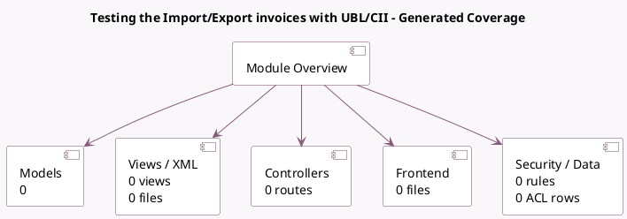

<!-- GENERATED:MODULE -->
---
tags: [odoo, community, module]
---

# Testing the Import/Export invoices with UBL/CII

- Scope: Community Addons
- Source: odoo/addons/l10n_account_edi_ubl_cii_tests
- Dependencies: [[docs/Community Addons/account_edi_ubl_cii/account_edi_ubl_cii|account_edi_ubl_cii]], [[docs/Community Addons/l10n_fr_account/l10n_fr_account|l10n_fr_account]], [[docs/Community Addons/l10n_be/l10n_be|l10n_be]], [[docs/Community Addons/l10n_de/l10n_de|l10n_de]], [[docs/Community Addons/l10n_nl/l10n_nl|l10n_nl]], [[docs/Community Addons/l10n_au/l10n_au|l10n_au]]

## Generated coverage

- Models: 0
- XML files with UI/data artifacts: 0
- Views: 0
- Actions: 0
- Menus: 0
- Rules (ir.rule): 0
- Access CSV entries: 0
- Controller units: 0
- Frontend asset files: 0

## Module map

## Navigation

- [[../Community Addons/Community Addons|Back to scope]]
- [[../../docs/docs|Back to docs]]

<!-- GENERATED:MODULE -->

