<!-- GENERATED:MODEL -->
---
tags: [odoo, community, generated, model]
---

# account.payment

- Module: [[docs/Community Addons/l10n_account_withholding_tax/l10n_account_withholding_tax|l10n_account_withholding_tax]]
- Scope: Community Addons
- Defined in module: extension only
- Source files: `models/account_payment.py`
- Python classes: `AccountPayment`

## Field footprint

- Detected fields: 6
- Field types: `Boolean` x 3, `Many2one` x 2, `One2many` x 1
- Relation fields: 3

## Sample fields

- `display_withholding`: `Boolean` (compute `_compute_display_withholding`)
- `outstanding_account_id`: `Many2one`
- `should_withhold_tax`: `Boolean` (compute `_compute_should_withhold_tax`, store `True`)
- `withholding_hide_tax_base_account`: `Boolean` (compute `_compute_withholding_hide_tax_base_account`)
- `withholding_line_ids`: `One2many` (comodel `account.payment.withholding.line`)
- `withholding_payment_account_id`: `Many2one` (related `payment_method_line_id.payment_account_id`)

## Method hints

- Detected methods: 8
- Action methods: none
- Compute methods: `_compute_display_withholding`, `_compute_outstanding_account_id`, `_compute_should_withhold_tax`, `_compute_withholding_hide_tax_base_account`
- Onchange methods: `_onchange_withholding_line_ids`

## Direct relation diagram

```plantuml
@startuml
!define ODOO_COLOR_PRIMARY #714B67
!define ODOO_COLOR_ACCENT #875A7B
!define ODOO_COLOR_BG #FAF7FA

skinparam backgroundColor ODOO_COLOR_BG
skinparam defaultTextAlignment left
skinparam ArrowColor ODOO_COLOR_ACCENT
skinparam ClassBackgroundColor white
skinparam ClassBorderColor ODOO_COLOR_PRIMARY
skinparam ComponentBackgroundColor white
skinparam ComponentBorderColor ODOO_COLOR_PRIMARY
skinparam NoteBackgroundColor #FFF8FF
skinparam NoteBorderColor ODOO_COLOR_ACCENT
skinparam SequenceLifeLineBorderColor ODOO_COLOR_ACCENT
skinparam SequenceLifeLineBackgroundColor #FFFFFF
skinparam SequenceParticipantBorderColor ODOO_COLOR_PRIMARY
skinparam SequenceParticipantBackgroundColor #FFFFFF
skinparam sequence {
  ArrowColor ODOO_COLOR_ACCENT
  ActorBorderColor ODOO_COLOR_PRIMARY
}
title account.payment - Direct Relations
class "account.payment" as account_payment
class "account.payment.withholding.line" as account_payment_withholding_line
account_payment --|> account_payment_withholding_line : withholding_line_ids
@enduml
```

## Navigation

- **Parent:** [[docs/Community Addons/l10n_account_withholding_tax/Models]]

<!-- GENERATED:MODEL -->
