<!-- GENERATED:MODEL -->
---
tags: [odoo, community, generated, model]
---

# account.payment.withholding.line

- Module: [[docs/Community Addons/l10n_account_withholding_tax/l10n_account_withholding_tax|l10n_account_withholding_tax]]
- Scope: Community Addons
- Defined in module: yes
- Source files: `models/account_payment_withholding_line.py`
- Python classes: `AccountPaymentWithholdingLine`
- Description: Payment withholding line
- Inherits: `account.withholding.line`

## Field footprint

- Detected fields: 1
- Field types: `Many2one` x 1
- Relation fields: 1

## Sample fields

- `payment_id`: `Many2one` (comodel `account.payment`)

## Method hints

- Detected methods: 10
- Action methods: none
- Compute methods: `_compute_comodel_currency_id`, `_compute_comodel_date`, `_compute_comodel_full_amount`, `_compute_comodel_payment_type`, `_compute_company_id`, `_compute_original_amounts`, `_compute_type_tax_use`
- Onchange methods: none

## Direct relation diagram

```plantuml
@startuml
!define ODOO_COLOR_PRIMARY #714B67
!define ODOO_COLOR_ACCENT #875A7B
!define ODOO_COLOR_BG #FAF7FA

skinparam backgroundColor ODOO_COLOR_BG
skinparam defaultTextAlignment left
skinparam ArrowColor ODOO_COLOR_ACCENT
skinparam ClassBackgroundColor white
skinparam ClassBorderColor ODOO_COLOR_PRIMARY
skinparam ComponentBackgroundColor white
skinparam ComponentBorderColor ODOO_COLOR_PRIMARY
skinparam NoteBackgroundColor #FFF8FF
skinparam NoteBorderColor ODOO_COLOR_ACCENT
skinparam SequenceLifeLineBorderColor ODOO_COLOR_ACCENT
skinparam SequenceLifeLineBackgroundColor #FFFFFF
skinparam SequenceParticipantBorderColor ODOO_COLOR_PRIMARY
skinparam SequenceParticipantBackgroundColor #FFFFFF
skinparam sequence {
  ArrowColor ODOO_COLOR_ACCENT
  ActorBorderColor ODOO_COLOR_PRIMARY
}
title account.payment.withholding.line - Direct Relations
class "account.payment.withholding.line" as account_payment_withholding_line
class "account.payment" as account_payment
account_payment_withholding_line --> account_payment : payment_id
@enduml
```

## Navigation

- **Parent:** [[docs/Community Addons/l10n_account_withholding_tax/Models]]

<!-- GENERATED:MODEL -->
