<!-- GENERATED:MODEL -->
---
tags: [odoo, community, generated, model]
---

# account.tax

- Module: [[docs/Community Addons/l10n_account_withholding_tax/l10n_account_withholding_tax|l10n_account_withholding_tax]]
- Scope: Community Addons
- Defined in module: extension only
- Source files: `models/account_tax.py`
- Python classes: `AccountTax`

## Field footprint

- Detected fields: 2
- Field types: `Boolean` x 1, `Many2one` x 1
- Relation fields: 1

## Sample fields

- `is_withholding_tax_on_payment`: `Boolean`
- `withholding_sequence_id`: `Many2one` (comodel `ir.sequence`)

## Method hints

- Detected methods: 5
- Action methods: none
- Compute methods: `_compute_tax_label`
- Onchange methods: `_onchange_amount`, `_onchange_is_withholding_tax_on_payment`

## Direct relation diagram

```plantuml
@startuml
!define ODOO_COLOR_PRIMARY #714B67
!define ODOO_COLOR_ACCENT #875A7B
!define ODOO_COLOR_BG #FAF7FA

skinparam backgroundColor ODOO_COLOR_BG
skinparam defaultTextAlignment left
skinparam ArrowColor ODOO_COLOR_ACCENT
skinparam ClassBackgroundColor white
skinparam ClassBorderColor ODOO_COLOR_PRIMARY
skinparam ComponentBackgroundColor white
skinparam ComponentBorderColor ODOO_COLOR_PRIMARY
skinparam NoteBackgroundColor #FFF8FF
skinparam NoteBorderColor ODOO_COLOR_ACCENT
skinparam SequenceLifeLineBorderColor ODOO_COLOR_ACCENT
skinparam SequenceLifeLineBackgroundColor #FFFFFF
skinparam SequenceParticipantBorderColor ODOO_COLOR_PRIMARY
skinparam SequenceParticipantBackgroundColor #FFFFFF
skinparam sequence {
  ArrowColor ODOO_COLOR_ACCENT
  ActorBorderColor ODOO_COLOR_PRIMARY
}
title account.tax - Direct Relations
class "account.tax" as account_tax
class "ir.sequence" as ir_sequence
account_tax --> ir_sequence : withholding_sequence_id
@enduml
```

## Navigation

- **Parent:** [[docs/Community Addons/l10n_account_withholding_tax/Models]]

<!-- GENERATED:MODEL -->
