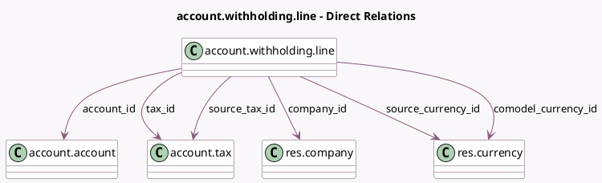

<!-- GENERATED:MODEL -->
---
tags: [odoo, community, generated, model]
---

# account.withholding.line

- Module: [[docs/Community Addons/l10n_account_withholding_tax/l10n_account_withholding_tax|l10n_account_withholding_tax]]
- Scope: Community Addons
- Defined in module: yes
- Source files: `models/account_withholding_line.py`
- Python classes: `AccountWithholdingLine`
- Description: withholding line
- Inherits: `analytic.mixin`

## Field footprint

- Detected fields: 24
- Field types: `Char` x 3, `Date` x 1, `Float` x 1, `Many2one` x 8, `Monetary` x 8, `Selection` x 3
- Relation fields: 8

## Sample fields

- `account_id`: `Many2one` (comodel `account.account`, compute `_compute_account_id`, store `True`)
- `amount`: `Monetary` (compute `_compute_amount`, store `True`)
- `base_amount`: `Monetary` (compute `_compute_base_amount`, store `True`)
- `comodel_company_currency_id`: `Many2one` (related `company_id.currency_id`)
- `comodel_currency_id`: `Many2one` (comodel `res.currency`, compute `_compute_comodel_currency_id`)
- `comodel_date`: `Date` (compute `_compute_comodel_date`)
- `comodel_payment_type`: `Selection` (compute `_compute_comodel_payment_type`)
- `comodel_percentage_paid_factor`: `Float` (compute `_compute_comodel_percentage_paid_factor`)
- `company_id`: `Many2one` (comodel `res.company`, compute `_compute_company_id`, store `True`)
- `name`: `Char`
- `original_base_amount`: `Monetary` (compute `_compute_original_amounts`)
- `original_tax_amount`: `Monetary` (compute `_compute_original_amounts`)
- `placeholder_type`: `Selection` (compute `_compute_placeholder_type`, store `True`)
- `placeholder_value`: `Char`
- `previous_placeholder_type`: `Selection` (compute `_compute_placeholder_type`, store `True`)
- `source_base_amount`: `Monetary`
- `source_base_amount_currency`: `Monetary`
- `source_currency_id`: `Many2one` (comodel `res.currency`)
- `source_tax_amount`: `Monetary`
- `source_tax_amount_currency`: `Monetary`

## Method hints

- Detected methods: 24
- Action methods: none
- Compute methods: `_compute_account_id`, `_compute_amount`, `_compute_base_amount`, `_compute_comodel_currency_id`, `_compute_comodel_date`, `_compute_comodel_payment_type`, `_compute_comodel_percentage_paid_factor`, `_compute_company_id`, and 4 more
- Onchange methods: none

## Direct relation diagram

## Navigation

- **Parent:** [[docs/Community Addons/l10n_account_withholding_tax/Models]]

<!-- GENERATED:MODEL -->
