<!-- GENERATED:MODEL -->
---
tags: [odoo, community, generated, model]
---

# account.fiscal.position

- Module: [[docs/Community Addons/l10n_ar/l10n_ar|l10n_ar]]
- Scope: Community Addons
- Defined in module: extension only
- Source files: `models/account_fiscal_position.py`
- Python classes: `AccountFiscalPosition`

## Field footprint

- Detected fields: 1
- Field types: `Many2many` x 1
- Relation fields: 1

## Sample fields

- `l10n_ar_afip_responsibility_type_ids`: `Many2many` (comodel `l10n_ar.afip.responsibility.type`)

## Method hints

- Detected methods: 1
- Action methods: none
- Compute methods: none
- Onchange methods: none

## Direct relation diagram

```plantuml
@startuml
!define ODOO_COLOR_PRIMARY #714B67
!define ODOO_COLOR_ACCENT #875A7B
!define ODOO_COLOR_BG #FAF7FA

skinparam backgroundColor ODOO_COLOR_BG
skinparam defaultTextAlignment left
skinparam ArrowColor ODOO_COLOR_ACCENT
skinparam ClassBackgroundColor white
skinparam ClassBorderColor ODOO_COLOR_PRIMARY
skinparam ComponentBackgroundColor white
skinparam ComponentBorderColor ODOO_COLOR_PRIMARY
skinparam NoteBackgroundColor #FFF8FF
skinparam NoteBorderColor ODOO_COLOR_ACCENT
skinparam SequenceLifeLineBorderColor ODOO_COLOR_ACCENT
skinparam SequenceLifeLineBackgroundColor #FFFFFF
skinparam SequenceParticipantBorderColor ODOO_COLOR_PRIMARY
skinparam SequenceParticipantBackgroundColor #FFFFFF
skinparam sequence {
  ArrowColor ODOO_COLOR_ACCENT
  ActorBorderColor ODOO_COLOR_PRIMARY
}
title account.fiscal.position - Direct Relations
class "account.fiscal.position" as account_fiscal_position
class "l10n_ar.afip.responsibility.type" as l10n_ar_afip_responsibility_type
account_fiscal_position .. l10n_ar_afip_responsibility_type : l10n_ar_afip_responsibility_type_ids
@enduml
```

## Navigation

- **Parent:** [[docs/Community Addons/l10n_ar/Models]]

<!-- GENERATED:MODEL -->
