<!-- GENERATED:MODEL -->
---
tags: [odoo, community, generated, model]
---

# account.journal

- Module: [[docs/Community Addons/l10n_ar/l10n_ar|l10n_ar]]
- Scope: Community Addons
- Defined in module: extension only
- Source files: `models/account_journal.py`
- Python classes: `AccountJournal`

## Field footprint

- Detected fields: 5
- Field types: `Boolean` x 1, `Integer` x 1, `Many2one` x 2, `Selection` x 1
- Relation fields: 2

## Sample fields

- `company_partner`: `Many2one` (comodel `res.partner`, related `company_id.partner_id`)
- `l10n_ar_afip_pos_number`: `Integer` (comodel `AFIP POS Number`)
- `l10n_ar_afip_pos_partner_id`: `Many2one` (comodel `res.partner`)
- `l10n_ar_afip_pos_system`: `Selection` (compute `_compute_l10n_ar_afip_pos_system`, store `True`)
- `l10n_ar_is_pos`: `Boolean` (compute `_compute_l10n_ar_is_pos`, store `True`)

## Method hints

- Detected methods: 10
- Action methods: none
- Compute methods: `_compute_l10n_ar_afip_pos_system`, `_compute_l10n_ar_is_pos`
- Onchange methods: `_onchange_set_short_name`

## Direct relation diagram

```plantuml
@startuml
!define ODOO_COLOR_PRIMARY #714B67
!define ODOO_COLOR_ACCENT #875A7B
!define ODOO_COLOR_BG #FAF7FA

skinparam backgroundColor ODOO_COLOR_BG
skinparam defaultTextAlignment left
skinparam ArrowColor ODOO_COLOR_ACCENT
skinparam ClassBackgroundColor white
skinparam ClassBorderColor ODOO_COLOR_PRIMARY
skinparam ComponentBackgroundColor white
skinparam ComponentBorderColor ODOO_COLOR_PRIMARY
skinparam NoteBackgroundColor #FFF8FF
skinparam NoteBorderColor ODOO_COLOR_ACCENT
skinparam SequenceLifeLineBorderColor ODOO_COLOR_ACCENT
skinparam SequenceLifeLineBackgroundColor #FFFFFF
skinparam SequenceParticipantBorderColor ODOO_COLOR_PRIMARY
skinparam SequenceParticipantBackgroundColor #FFFFFF
skinparam sequence {
  ArrowColor ODOO_COLOR_ACCENT
  ActorBorderColor ODOO_COLOR_PRIMARY
}
title account.journal - Direct Relations
class "account.journal" as account_journal
class "res.partner" as res_partner
account_journal --> res_partner : company_partner
account_journal --> res_partner : l10n_ar_afip_pos_partner_id
@enduml
```

## Navigation

- **Parent:** [[docs/Community Addons/l10n_ar/Models]]

<!-- GENERATED:MODEL -->
