<!-- GENERATED:MODEL -->
---
tags: [odoo, community, generated, model]
---

# res.partner

- Module: [[docs/Community Addons/l10n_ar/l10n_ar|l10n_ar]]
- Scope: Community Addons
- Defined in module: extension only
- Source files: `models/res_partner.py`
- Python classes: `ResPartner`

## Field footprint

- Detected fields: 5
- Field types: `Char` x 3, `Many2one` x 1, `Selection` x 1
- Relation fields: 1

## Sample fields

- `l10n_ar_afip_responsibility_type_id`: `Many2one` (comodel `l10n_ar.afip.responsibility.type`)
- `l10n_ar_formatted_vat`: `Char` (compute `_compute_l10n_ar_formatted_vat`)
- `l10n_ar_gross_income_number`: `Char` (comodel `Gross Income Number`)
- `l10n_ar_gross_income_type`: `Selection`
- `l10n_ar_vat`: `Char` (compute `_compute_l10n_ar_vat`)

## Method hints

- Detected methods: 9
- Action methods: none
- Compute methods: `_compute_l10n_ar_formatted_vat`, `_compute_l10n_ar_vat`
- Onchange methods: none

## Direct relation diagram

```plantuml
@startuml
!define ODOO_COLOR_PRIMARY #714B67
!define ODOO_COLOR_ACCENT #875A7B
!define ODOO_COLOR_BG #FAF7FA

skinparam backgroundColor ODOO_COLOR_BG
skinparam defaultTextAlignment left
skinparam ArrowColor ODOO_COLOR_ACCENT
skinparam ClassBackgroundColor white
skinparam ClassBorderColor ODOO_COLOR_PRIMARY
skinparam ComponentBackgroundColor white
skinparam ComponentBorderColor ODOO_COLOR_PRIMARY
skinparam NoteBackgroundColor #FFF8FF
skinparam NoteBorderColor ODOO_COLOR_ACCENT
skinparam SequenceLifeLineBorderColor ODOO_COLOR_ACCENT
skinparam SequenceLifeLineBackgroundColor #FFFFFF
skinparam SequenceParticipantBorderColor ODOO_COLOR_PRIMARY
skinparam SequenceParticipantBackgroundColor #FFFFFF
skinparam sequence {
  ArrowColor ODOO_COLOR_ACCENT
  ActorBorderColor ODOO_COLOR_PRIMARY
}
title res.partner - Direct Relations
class "res.partner" as res_partner
class "l10n_ar.afip.responsibility.type" as l10n_ar_afip_responsibility_type
res_partner --> l10n_ar_afip_responsibility_type : l10n_ar_afip_responsibility_type_id
@enduml
```

## Navigation

- **Parent:** [[docs/Community Addons/l10n_ar/Models]]

<!-- GENERATED:MODEL -->
