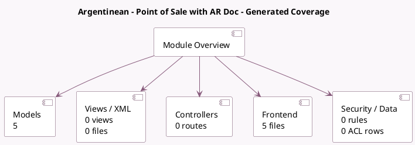

<!-- GENERATED:MODULE -->
---
tags: [odoo, community, module]
---

# Argentinean - Point of Sale with AR Doc

- Scope: Community Addons
- Source: odoo/addons/l10n_ar_pos
- Dependencies: [[docs/Community Addons/l10n_ar/l10n_ar|l10n_ar]], [[docs/Community Addons/point_of_sale/point_of_sale|point_of_sale]]

## Generated coverage

- Models: 5
- XML files with UI/data artifacts: 0
- Views: 0
- Actions: 0
- Menus: 0
- Rules (ir.rule): 0
- Access CSV entries: 0
- Controller units: 0
- Frontend asset files: 5

## Module map

## Detail notes

- Models: [[docs/Community Addons/l10n_ar_pos/Models|Models]] (5)
- Frontend: [[docs/Community Addons/l10n_ar_pos/Frontend|Frontend]] (5 files)

## Key models

- `l10n_ar.afip.responsibility.type`
- `l10n_latam.identification.type`
- `pos.config`
- `pos.session`
- `res.partner`

## Navigation

- [[../Community Addons/Community Addons|Back to scope]]
- [[../../docs/docs|Back to docs]]

<!-- GENERATED:MODULE -->

