<!-- GENERATED:MODEL -->
---
tags: [odoo, community, generated, model]
---

# stock.picking.type

- Module: [[docs/Community Addons/l10n_ar_stock/l10n_ar_stock|l10n_ar_stock]]
- Scope: Community Addons
- Defined in module: extension only
- Source files: `models/stock_picking_type.py`
- Python classes: `StockPickingType`

## Field footprint

- Detected fields: 8
- Field types: `Char` x 4, `Date` x 1, `Integer` x 1, `Many2one` x 2
- Relation fields: 2

## Sample fields

- `l10n_ar_cai_authorization_code`: `Char`
- `l10n_ar_cai_expiration_date`: `Date`
- `l10n_ar_delivery_sequence_prefix`: `Char` (compute `_compute_l10n_ar_stock_sequence_fields`)
- `l10n_ar_document_type_id`: `Many2one` (comodel `l10n_latam.document.type`)
- `l10n_ar_next_delivery_number`: `Integer` (compute `_compute_l10n_ar_stock_sequence_fields`)
- `l10n_ar_sequence_id`: `Many2one` (comodel `ir.sequence`)
- `l10n_ar_sequence_number_end`: `Char`
- `l10n_ar_sequence_number_start`: `Char`

## Method hints

- Detected methods: 6
- Action methods: none
- Compute methods: `_compute_l10n_ar_stock_sequence_fields`
- Onchange methods: none

## Direct relation diagram

```plantuml
@startuml
!define ODOO_COLOR_PRIMARY #714B67
!define ODOO_COLOR_ACCENT #875A7B
!define ODOO_COLOR_BG #FAF7FA

skinparam backgroundColor ODOO_COLOR_BG
skinparam defaultTextAlignment left
skinparam ArrowColor ODOO_COLOR_ACCENT
skinparam ClassBackgroundColor white
skinparam ClassBorderColor ODOO_COLOR_PRIMARY
skinparam ComponentBackgroundColor white
skinparam ComponentBorderColor ODOO_COLOR_PRIMARY
skinparam NoteBackgroundColor #FFF8FF
skinparam NoteBorderColor ODOO_COLOR_ACCENT
skinparam SequenceLifeLineBorderColor ODOO_COLOR_ACCENT
skinparam SequenceLifeLineBackgroundColor #FFFFFF
skinparam SequenceParticipantBorderColor ODOO_COLOR_PRIMARY
skinparam SequenceParticipantBackgroundColor #FFFFFF
skinparam sequence {
  ArrowColor ODOO_COLOR_ACCENT
  ActorBorderColor ODOO_COLOR_PRIMARY
}
title stock.picking.type - Direct Relations
class "stock.picking.type" as stock_picking_type
class "ir.sequence" as ir_sequence
class "l10n_latam.document.type" as l10n_latam_document_type
stock_picking_type --> l10n_latam_document_type : l10n_ar_document_type_id
stock_picking_type --> ir_sequence : l10n_ar_sequence_id
@enduml
```

## Navigation

- **Parent:** [[docs/Community Addons/l10n_ar_stock/Models]]

<!-- GENERATED:MODEL -->
