<!-- GENERATED:MODEL -->
---
tags: [odoo, community, generated, model]
---

# account.payment.register

- Module: [[docs/Community Addons/l10n_ar_withholding/l10n_ar_withholding|l10n_ar_withholding]]
- Scope: Community Addons
- Defined in module: extension only
- Source files: `wizards/account_payment_register.py`
- Python classes: `AccountPaymentRegister`

## Field footprint

- Detected fields: 3
- Field types: `Boolean` x 1, `Monetary` x 1, `One2many` x 1
- Relation fields: 1

## Sample fields

- `l10n_ar_adjustment_warning`: `Boolean` (compute `_compute_l10n_ar_adjustment_warning`)
- `l10n_ar_net_amount`: `Monetary` (compute `_compute_l10n_ar_net_amount`)
- `l10n_ar_withholding_ids`: `One2many` (comodel `l10n_ar.payment.register.withholding`, compute `_compute_l10n_ar_withholding_ids`, store `True`)

## Method hints

- Detected methods: 6
- Action methods: `action_create_payments`
- Compute methods: `_compute_l10n_ar_adjustment_warning`, `_compute_l10n_ar_net_amount`, `_compute_l10n_ar_withholding_ids`
- Onchange methods: none

## Direct relation diagram

```plantuml
@startuml
!define ODOO_COLOR_PRIMARY #714B67
!define ODOO_COLOR_ACCENT #875A7B
!define ODOO_COLOR_BG #FAF7FA

skinparam backgroundColor ODOO_COLOR_BG
skinparam defaultTextAlignment left
skinparam ArrowColor ODOO_COLOR_ACCENT
skinparam ClassBackgroundColor white
skinparam ClassBorderColor ODOO_COLOR_PRIMARY
skinparam ComponentBackgroundColor white
skinparam ComponentBorderColor ODOO_COLOR_PRIMARY
skinparam NoteBackgroundColor #FFF8FF
skinparam NoteBorderColor ODOO_COLOR_ACCENT
skinparam SequenceLifeLineBorderColor ODOO_COLOR_ACCENT
skinparam SequenceLifeLineBackgroundColor #FFFFFF
skinparam SequenceParticipantBorderColor ODOO_COLOR_PRIMARY
skinparam SequenceParticipantBackgroundColor #FFFFFF
skinparam sequence {
  ArrowColor ODOO_COLOR_ACCENT
  ActorBorderColor ODOO_COLOR_PRIMARY
}
title account.payment.register - Direct Relations
class "account.payment.register" as account_payment_register
class "l10n_ar.payment.register.withholding" as l10n_ar_payment_register_withholding
account_payment_register --|> l10n_ar_payment_register_withholding : l10n_ar_withholding_ids
@enduml
```

## Navigation

- **Parent:** [[docs/Community Addons/l10n_ar_withholding/Models]]

<!-- GENERATED:MODEL -->
