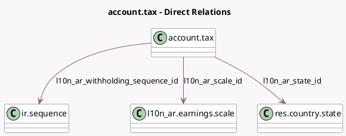

<!-- GENERATED:MODEL -->
---
tags: [odoo, community, generated, model]
---

# account.tax

- Module: [[docs/Community Addons/l10n_ar_withholding/l10n_ar_withholding|l10n_ar_withholding]]
- Scope: Community Addons
- Defined in module: extension only
- Source files: `models/account_tax.py`
- Python classes: `AccountTax`

## Field footprint

- Detected fields: 9
- Field types: `Char` x 1, `Float` x 2, `Many2one` x 3, `Selection` x 3
- Relation fields: 3

## Sample fields

- `l10n_ar_code`: `Char` (comodel `AFIP Code`)
- `l10n_ar_minimum_threshold`: `Float`
- `l10n_ar_non_taxable_amount`: `Float`
- `l10n_ar_scale_id`: `Many2one` (comodel `l10n_ar.earnings.scale`)
- `l10n_ar_state_id`: `Many2one` (comodel `res.country.state`)
- `l10n_ar_tax_type`: `Selection`
- `l10n_ar_type_tax_use`: `Selection` (compute `_compute_l10n_ar_type_tax_use`)
- `l10n_ar_withholding_payment_type`: `Selection`
- `l10n_ar_withholding_sequence_id`: `Many2one` (comodel `ir.sequence`)

## Method hints

- Detected methods: 2
- Action methods: none
- Compute methods: `_compute_l10n_ar_type_tax_use`
- Onchange methods: `_inverse_l10n_ar_type_tax_use`

## Direct relation diagram

## Navigation

- **Parent:** [[docs/Community Addons/l10n_ar_withholding/Models]]

<!-- GENERATED:MODEL -->
