<!-- GENERATED:MODEL -->
---
tags: [odoo, community, generated, model]
---

# l10n_ar.earnings.scale.line

- Module: [[docs/Community Addons/l10n_ar_withholding/l10n_ar_withholding|l10n_ar_withholding]]
- Scope: Community Addons
- Defined in module: yes
- Source files: `models/l10n_ar_earnings_scale.py`
- Python classes: `L10n_ArEarningsScaleLine`
- Description: l10n_ar.earnings.scale.line

## Field footprint

- Detected fields: 7
- Field types: `Many2one` x 2, `Monetary` x 5
- Relation fields: 2

## Sample fields

- `currency_id`: `Many2one` (comodel `res.currency`, store `False`)
- `excess_amount`: `Monetary`
- `fixed_amount`: `Monetary`
- `from_amount`: `Monetary` (compute `_compute_from_amount`)
- `percentage`: `Monetary`
- `scale_id`: `Many2one` (comodel `l10n_ar.earnings.scale`)
- `to_amount`: `Monetary`

## Method hints

- Detected methods: 1
- Action methods: none
- Compute methods: `_compute_from_amount`
- Onchange methods: none

## Direct relation diagram

```plantuml
@startuml
!define ODOO_COLOR_PRIMARY #714B67
!define ODOO_COLOR_ACCENT #875A7B
!define ODOO_COLOR_BG #FAF7FA

skinparam backgroundColor ODOO_COLOR_BG
skinparam defaultTextAlignment left
skinparam ArrowColor ODOO_COLOR_ACCENT
skinparam ClassBackgroundColor white
skinparam ClassBorderColor ODOO_COLOR_PRIMARY
skinparam ComponentBackgroundColor white
skinparam ComponentBorderColor ODOO_COLOR_PRIMARY
skinparam NoteBackgroundColor #FFF8FF
skinparam NoteBorderColor ODOO_COLOR_ACCENT
skinparam SequenceLifeLineBorderColor ODOO_COLOR_ACCENT
skinparam SequenceLifeLineBackgroundColor #FFFFFF
skinparam SequenceParticipantBorderColor ODOO_COLOR_PRIMARY
skinparam SequenceParticipantBackgroundColor #FFFFFF
skinparam sequence {
  ArrowColor ODOO_COLOR_ACCENT
  ActorBorderColor ODOO_COLOR_PRIMARY
}
title l10n_ar.earnings.scale.line - Direct Relations
class "l10n_ar.earnings.scale.line" as l10n_ar_earnings_scale_line
class "l10n_ar.earnings.scale" as l10n_ar_earnings_scale
class "res.currency" as res_currency
l10n_ar_earnings_scale_line --> l10n_ar_earnings_scale : scale_id
l10n_ar_earnings_scale_line --> res_currency : currency_id
@enduml
```

## Navigation

- **Parent:** [[docs/Community Addons/l10n_ar_withholding/Models]]

<!-- GENERATED:MODEL -->
