<!-- GENERATED:MODEL -->
---
tags: [odoo, community, generated, model]
---

# l10n_ar.partner.tax

- Module: [[docs/Community Addons/l10n_ar_withholding/l10n_ar_withholding|l10n_ar_withholding]]
- Scope: Community Addons
- Defined in module: yes
- Source files: `models/l10n_ar_partner_tax.py`
- Python classes: `L10n_ArPartnerTax`
- Description: Argentinean Partner Taxes

## Field footprint

- Detected fields: 6
- Field types: `Char` x 1, `Date` x 2, `Many2one` x 3
- Relation fields: 3

## Sample fields

- `company_id`: `Many2one` (related `tax_id.company_id`, store `True`)
- `from_date`: `Date`
- `partner_id`: `Many2one` (comodel `res.partner`)
- `ref`: `Char`
- `tax_id`: `Many2one` (comodel `account.tax`)
- `to_date`: `Date`

## Method hints

- Detected methods: 1
- Action methods: none
- Compute methods: none
- Onchange methods: none

## Direct relation diagram

```plantuml
@startuml
!define ODOO_COLOR_PRIMARY #714B67
!define ODOO_COLOR_ACCENT #875A7B
!define ODOO_COLOR_BG #FAF7FA

skinparam backgroundColor ODOO_COLOR_BG
skinparam defaultTextAlignment left
skinparam ArrowColor ODOO_COLOR_ACCENT
skinparam ClassBackgroundColor white
skinparam ClassBorderColor ODOO_COLOR_PRIMARY
skinparam ComponentBackgroundColor white
skinparam ComponentBorderColor ODOO_COLOR_PRIMARY
skinparam NoteBackgroundColor #FFF8FF
skinparam NoteBorderColor ODOO_COLOR_ACCENT
skinparam SequenceLifeLineBorderColor ODOO_COLOR_ACCENT
skinparam SequenceLifeLineBackgroundColor #FFFFFF
skinparam SequenceParticipantBorderColor ODOO_COLOR_PRIMARY
skinparam SequenceParticipantBackgroundColor #FFFFFF
skinparam sequence {
  ArrowColor ODOO_COLOR_ACCENT
  ActorBorderColor ODOO_COLOR_PRIMARY
}
title l10n_ar.partner.tax - Direct Relations
class "l10n_ar.partner.tax" as l10n_ar_partner_tax
class "account.tax" as account_tax
class "res.partner" as res_partner
l10n_ar_partner_tax --> res_partner : partner_id
l10n_ar_partner_tax --> account_tax : tax_id
@enduml
```

## Navigation

- **Parent:** [[docs/Community Addons/l10n_ar_withholding/Models]]

<!-- GENERATED:MODEL -->
