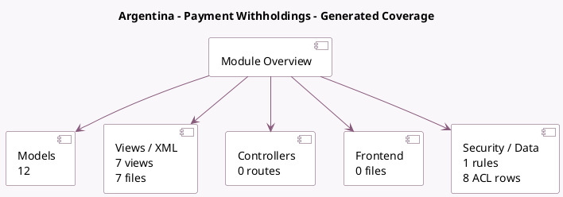

<!-- GENERATED:MODULE -->
---
tags: [odoo, community, module]
---

# Argentina - Payment Withholdings

- Scope: Community Addons
- Source: odoo/addons/l10n_ar_withholding
- Dependencies: [[docs/Community Addons/l10n_ar/l10n_ar|l10n_ar]], [[docs/Community Addons/l10n_latam_check/l10n_latam_check|l10n_latam_check]]

## Generated coverage

- Models: 12
- XML files with UI/data artifacts: 7
- Views: 7
- Actions: 1
- Menus: 1
- Rules (ir.rule): 1
- Access CSV entries: 8
- Controller units: 0
- Frontend asset files: 0

## Module map

## Detail notes

- Models: [[docs/Community Addons/l10n_ar_withholding/Models|Models]] (12)
- Views and XML: [[docs/Community Addons/l10n_ar_withholding/Views|Views]] (7 files)

## Key models

- `account.chart.template`
- `account.move`
- `account.payment`
- `account.payment.register`
- `account.tax`
- `l10n_ar.earnings.scale`
- `l10n_ar.earnings.scale.line`
- `l10n_ar.partner.tax`
- `l10n_ar.payment.register.withholding`
- `res.company`
- `res.config.settings`
- `res.partner`

## Navigation

- [[../Community Addons/Community Addons|Back to scope]]
- [[../../docs/docs|Back to docs]]

<!-- GENERATED:MODULE -->

