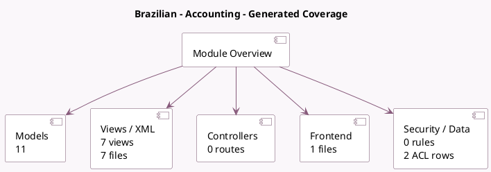

<!-- GENERATED:MODULE -->
---
tags: [odoo, community, module]
---

# Brazilian - Accounting

- Scope: Community Addons
- Source: odoo/addons/l10n_br
- Dependencies: [[docs/Community Addons/account/account|account]], [[docs/Community Addons/account_qr_code_emv/account_qr_code_emv|account_qr_code_emv]], [[docs/Community Addons/base_address_extended/base_address_extended|base_address_extended]], [[docs/Community Addons/l10n_latam_base/l10n_latam_base|l10n_latam_base]], [[docs/Community Addons/l10n_latam_invoice_document/l10n_latam_invoice_document|l10n_latam_invoice_document]]

## Generated coverage

- Models: 11
- XML files with UI/data artifacts: 7
- Views: 7
- Actions: 0
- Menus: 1
- Rules (ir.rule): 0
- Access CSV entries: 2
- Controller units: 0
- Frontend asset files: 1

## Module map

## Detail notes

- Models: [[docs/Community Addons/l10n_br/Models|Models]] (11)
- Views and XML: [[docs/Community Addons/l10n_br/Views|Views]] (7 files)
- Frontend: [[docs/Community Addons/l10n_br/Frontend|Frontend]] (1 files)

## Key models

- `account.chart.template`
- `account.fiscal.position`
- `account.journal`
- `account.move`
- `account.move.reversal`
- `account.tax`
- `l10n_br.zip.range`
- `res.city`
- `res.company`
- `res.partner`
- `res.partner.bank`

## Navigation

- [[../Community Addons/Community Addons|Back to scope]]
- [[../../docs/docs|Back to docs]]

<!-- GENERATED:MODULE -->

