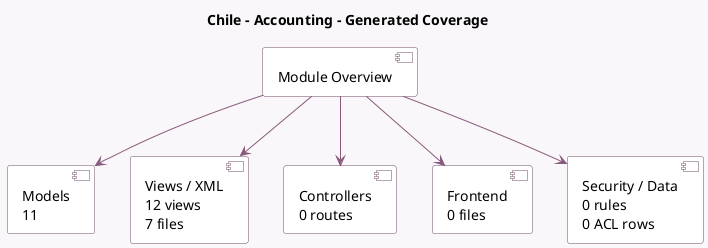

<!-- GENERATED:MODULE -->
---
tags: [odoo, community, module]
---

# Chile - Accounting

- Scope: Community Addons
- Source: odoo/addons/l10n_cl
- Dependencies: [[docs/Community Addons/contacts/contacts|contacts]], [[docs/Community Addons/base_vat/base_vat|base_vat]], [[docs/Community Addons/l10n_latam_base/l10n_latam_base|l10n_latam_base]], [[docs/Community Addons/l10n_latam_invoice_document/l10n_latam_invoice_document|l10n_latam_invoice_document]], [[docs/Community Addons/uom/uom|uom]], [[docs/Community Addons/account/account|account]]

## Generated coverage

- Models: 11
- XML files with UI/data artifacts: 7
- Views: 12
- Actions: 2
- Menus: 2
- Rules (ir.rule): 0
- Access CSV entries: 0
- Controller units: 0
- Frontend asset files: 0

## Module map

## Detail notes

- Models: [[docs/Community Addons/l10n_cl/Models|Models]] (11)
- Views and XML: [[docs/Community Addons/l10n_cl/Views|Views]] (7 files)

## Key models

- `account.chart.template`
- `account.move`
- `account.move.line`
- `account.tax`
- `l10n_latam.document.type`
- `res.bank`
- `res.company`
- `res.country`
- `res.currency`
- `res.partner`
- `uom.uom`

## Navigation

- [[../Community Addons/Community Addons|Back to scope]]
- [[../../docs/docs|Back to docs]]

<!-- GENERATED:MODULE -->

