<!-- GENERATED:MODEL -->
---
tags: [odoo, community, generated, model]
---

# payment.method

- Module: [[docs/Community Addons/l10n_ec_sale/l10n_ec_sale|l10n_ec_sale]]
- Scope: Community Addons
- Defined in module: extension only
- Source files: `models/payment_method.py`
- Python classes: `PaymentMethod`

## Field footprint

- Detected fields: 2
- Field types: `Char` x 1, `Many2one` x 1
- Relation fields: 1

## Sample fields

- `fiscal_country_codes`: `Char` (store `False`)
- `l10n_ec_sri_payment_id`: `Many2one` (comodel `l10n_ec.sri.payment`)

## Method hints

- Detected methods: 1
- Action methods: none
- Compute methods: none
- Onchange methods: none

## Direct relation diagram

```plantuml
@startuml
!define ODOO_COLOR_PRIMARY #714B67
!define ODOO_COLOR_ACCENT #875A7B
!define ODOO_COLOR_BG #FAF7FA

skinparam backgroundColor ODOO_COLOR_BG
skinparam defaultTextAlignment left
skinparam ArrowColor ODOO_COLOR_ACCENT
skinparam ClassBackgroundColor white
skinparam ClassBorderColor ODOO_COLOR_PRIMARY
skinparam ComponentBackgroundColor white
skinparam ComponentBorderColor ODOO_COLOR_PRIMARY
skinparam NoteBackgroundColor #FFF8FF
skinparam NoteBorderColor ODOO_COLOR_ACCENT
skinparam SequenceLifeLineBorderColor ODOO_COLOR_ACCENT
skinparam SequenceLifeLineBackgroundColor #FFFFFF
skinparam SequenceParticipantBorderColor ODOO_COLOR_PRIMARY
skinparam SequenceParticipantBackgroundColor #FFFFFF
skinparam sequence {
  ArrowColor ODOO_COLOR_ACCENT
  ActorBorderColor ODOO_COLOR_PRIMARY
}
title payment.method - Direct Relations
class "payment.method" as payment_method
class "l10n_ec.sri.payment" as l10n_ec_sri_payment
payment_method --> l10n_ec_sri_payment : l10n_ec_sri_payment_id
@enduml
```

## Navigation

- **Parent:** [[docs/Community Addons/l10n_ec_sale/Models]]

<!-- GENERATED:MODEL -->
