<!-- GENERATED:MODEL -->
---
tags: [odoo, community, generated, model]
---

# l10n_eg_edi.thumb.drive

- Module: [[docs/Community Addons/l10n_eg_edi_eta/l10n_eg_edi_eta|l10n_eg_edi_eta]]
- Scope: Community Addons
- Defined in module: yes
- Source files: `models/eta_thumb_drive.py`
- Python classes: `L10n_Eg_EdiThumbDrive`
- Description: Thumb drive used to sign invoices in Egypt

## Field footprint

- Detected fields: 5
- Field types: `Binary` x 1, `Char` x 2, `Many2one` x 2
- Relation fields: 2

## Sample fields

- `access_token`: `Char`
- `certificate`: `Binary` (comodel `ETA Certificate`)
- `company_id`: `Many2one` (comodel `res.company`)
- `pin`: `Char` (comodel `ETA USB Pin`)
- `user_id`: `Many2one` (comodel `res.users`)

## Method hints

- Detected methods: 9
- Action methods: `action_set_certificate_from_usb`, `action_sign_invoices`
- Compute methods: none
- Onchange methods: none

## Direct relation diagram

```plantuml
@startuml
!define ODOO_COLOR_PRIMARY #714B67
!define ODOO_COLOR_ACCENT #875A7B
!define ODOO_COLOR_BG #FAF7FA

skinparam backgroundColor ODOO_COLOR_BG
skinparam defaultTextAlignment left
skinparam ArrowColor ODOO_COLOR_ACCENT
skinparam ClassBackgroundColor white
skinparam ClassBorderColor ODOO_COLOR_PRIMARY
skinparam ComponentBackgroundColor white
skinparam ComponentBorderColor ODOO_COLOR_PRIMARY
skinparam NoteBackgroundColor #FFF8FF
skinparam NoteBorderColor ODOO_COLOR_ACCENT
skinparam SequenceLifeLineBorderColor ODOO_COLOR_ACCENT
skinparam SequenceLifeLineBackgroundColor #FFFFFF
skinparam SequenceParticipantBorderColor ODOO_COLOR_PRIMARY
skinparam SequenceParticipantBackgroundColor #FFFFFF
skinparam sequence {
  ArrowColor ODOO_COLOR_ACCENT
  ActorBorderColor ODOO_COLOR_PRIMARY
}
title l10n_eg_edi.thumb.drive - Direct Relations
class "l10n_eg_edi.thumb.drive" as l10n_eg_edi_thumb_drive
class "res.company" as res_company
class "res.users" as res_users
l10n_eg_edi_thumb_drive --> res_users : user_id
l10n_eg_edi_thumb_drive --> res_company : company_id
@enduml
```

## Navigation

- **Parent:** [[docs/Community Addons/l10n_eg_edi_eta/Models]]

<!-- GENERATED:MODEL -->
