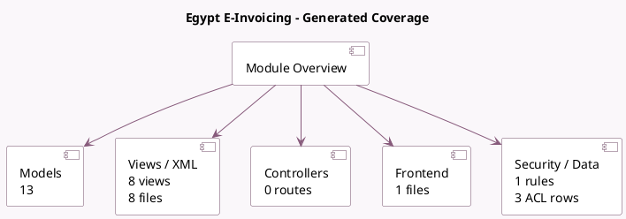

<!-- GENERATED:MODULE -->
---
tags: [odoo, community, module]
---

# Egypt E-Invoicing

- Scope: Community Addons
- Source: odoo/addons/l10n_eg_edi_eta
- Dependencies: [[docs/Community Addons/account_edi/account_edi|account_edi]], [[docs/Community Addons/l10n_eg/l10n_eg|l10n_eg]]

## Summary

            Egypt Tax Authority Invoice Integration
        

## Generated coverage

- Models: 13
- XML files with UI/data artifacts: 8
- Views: 8
- Actions: 2
- Menus: 2
- Rules (ir.rule): 1
- Access CSV entries: 3
- Controller units: 0
- Frontend asset files: 1

## Module map

## Detail notes

- Models: [[docs/Community Addons/l10n_eg_edi_eta/Models|Models]] (13)
- Views and XML: [[docs/Community Addons/l10n_eg_edi_eta/Views|Views]] (8 files)
- Frontend: [[docs/Community Addons/l10n_eg_edi_eta/Frontend|Frontend]] (1 files)

## Key models

- `account.edi.format`
- `account.journal`
- `account.move`
- `l10n_eg_edi.activity.type`
- `l10n_eg_edi.thumb.drive`
- `l10n_eg_edi.uom.code`
- `product.product`
- `product.template`
- `res.company`
- `res.config.settings`
- `res.currency.rate`
- `res.partner`

## Navigation

- [[../Community Addons/Community Addons|Back to scope]]
- [[../../docs/docs|Back to docs]]

<!-- GENERATED:MODULE -->

