<!-- GENERATED:MODEL -->
---
tags: [odoo, community, generated, model]
---

# res.partner

- Module: [[docs/Community Addons/l10n_es_edi_facturae/l10n_es_edi_facturae|l10n_es_edi_facturae]]
- Scope: Community Addons
- Defined in module: extension only
- Source files: `models/res_partner.py`
- Python classes: `ResPartner`

## Field footprint

- Detected fields: 7
- Field types: `Char` x 4, `Many2many` x 1, `Selection` x 2
- Relation fields: 1

## Sample fields

- `invoice_edi_format`: `Selection`
- `l10n_es_edi_facturae_ac_center_code`: `Char`
- `l10n_es_edi_facturae_ac_logical_operational_point`: `Char`
- `l10n_es_edi_facturae_ac_physical_gln`: `Char`
- `l10n_es_edi_facturae_ac_role_type_ids`: `Many2many` (comodel `l10n_es_edi_facturae.ac_role_type`)
- `l10n_es_edi_facturae_residence_type`: `Char` (compute `_compute_l10n_es_edi_facturae_residence_type`, store `False`)
- `type`: `Selection`

## Method hints

- Detected methods: 4
- Action methods: none
- Compute methods: `_compute_l10n_es_edi_facturae_residence_type`
- Onchange methods: none

## Direct relation diagram

```plantuml
@startuml
!define ODOO_COLOR_PRIMARY #714B67
!define ODOO_COLOR_ACCENT #875A7B
!define ODOO_COLOR_BG #FAF7FA

skinparam backgroundColor ODOO_COLOR_BG
skinparam defaultTextAlignment left
skinparam ArrowColor ODOO_COLOR_ACCENT
skinparam ClassBackgroundColor white
skinparam ClassBorderColor ODOO_COLOR_PRIMARY
skinparam ComponentBackgroundColor white
skinparam ComponentBorderColor ODOO_COLOR_PRIMARY
skinparam NoteBackgroundColor #FFF8FF
skinparam NoteBorderColor ODOO_COLOR_ACCENT
skinparam SequenceLifeLineBorderColor ODOO_COLOR_ACCENT
skinparam SequenceLifeLineBackgroundColor #FFFFFF
skinparam SequenceParticipantBorderColor ODOO_COLOR_PRIMARY
skinparam SequenceParticipantBackgroundColor #FFFFFF
skinparam sequence {
  ArrowColor ODOO_COLOR_ACCENT
  ActorBorderColor ODOO_COLOR_PRIMARY
}
title res.partner - Direct Relations
class "res.partner" as res_partner
class "l10n_es_edi_facturae.ac_role_type" as l10n_es_edi_facturae_ac_role_type
res_partner .. l10n_es_edi_facturae_ac_role_type : l10n_es_edi_facturae_ac_role_type_ids
@enduml
```

## Navigation

- **Parent:** [[docs/Community Addons/l10n_es_edi_facturae/Models]]

<!-- GENERATED:MODEL -->
