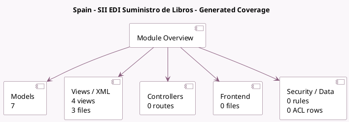

<!-- GENERATED:MODULE -->
---
tags: [odoo, community, module]
---

# Spain - SII EDI Suministro de Libros

- Scope: Community Addons
- Source: odoo/addons/l10n_es_edi_sii
- Dependencies: [[docs/Community Addons/certificate/certificate|certificate]], [[docs/Community Addons/l10n_es/l10n_es|l10n_es]], [[docs/Community Addons/account_edi/account_edi|account_edi]]

## Generated coverage

- Models: 7
- XML files with UI/data artifacts: 3
- Views: 4
- Actions: 1
- Menus: 2
- Rules (ir.rule): 0
- Access CSV entries: 0
- Controller units: 0
- Frontend asset files: 0

## Module map

## Detail notes

- Models: [[docs/Community Addons/l10n_es_edi_sii/Models|Models]] (7)
- Views and XML: [[docs/Community Addons/l10n_es_edi_sii/Views|Views]] (3 files)

## Key models

- `account.edi.format`
- `account.move`
- `account.move.send`
- `account.resequence.wizard`
- `certificate.certificate`
- `res.company`
- `res.config.settings`

## Navigation

- [[../Community Addons/Community Addons|Back to scope]]
- [[../../docs/docs|Back to docs]]

<!-- GENERATED:MODULE -->

