<!-- GENERATED:MODEL -->
---
tags: [odoo, community, generated, model]
---

# account.move

- Module: [[docs/Community Addons/l10n_es_edi_tbai/l10n_es_edi_tbai|l10n_es_edi_tbai]]
- Scope: Community Addons
- Defined in module: extension only
- Source files: `models/account_move.py`
- Python classes: `AccountMove`

## Field footprint

- Detected fields: 11
- Field types: `Binary` x 2, `Boolean` x 1, `Char` x 2, `Integer` x 1, `Many2many` x 1, `Many2one` x 2, `Selection` x 2
- Relation fields: 3

## Sample fields

- `l10n_es_tbai_cancel_document_id`: `Many2one` (comodel `l10n_es_edi_tbai.document`)
- `l10n_es_tbai_cancel_file`: `Binary` (related `l10n_es_tbai_cancel_document_id.xml_attachment_id.datas`)
- `l10n_es_tbai_cancel_file_name`: `Char` (related `l10n_es_tbai_cancel_document_id.xml_attachment_id.name`)
- `l10n_es_tbai_chain_index`: `Integer` (related `l10n_es_tbai_post_document_id.chain_index`)
- `l10n_es_tbai_is_required`: `Boolean` (compute `_compute_l10n_es_tbai_is_required`)
- `l10n_es_tbai_post_document_id`: `Many2one` (comodel `l10n_es_edi_tbai.document`)
- `l10n_es_tbai_post_file`: `Binary` (related `l10n_es_tbai_post_document_id.xml_attachment_id.datas`)
- `l10n_es_tbai_post_file_name`: `Char` (related `l10n_es_tbai_post_document_id.xml_attachment_id.name`)
- `l10n_es_tbai_refund_reason`: `Selection`
- `l10n_es_tbai_reversed_ids`: `Many2many` (comodel `account.move`)
- `l10n_es_tbai_state`: `Selection` (compute `_compute_l10n_es_tbai_state`)

## Method hints

- Detected methods: 21
- Action methods: none
- Compute methods: `_compute_l10n_es_tbai_is_required`, `_compute_l10n_es_tbai_state`, `_compute_show_reset_to_draft_button`
- Onchange methods: none

## Direct relation diagram

```plantuml
@startuml
!define ODOO_COLOR_PRIMARY #714B67
!define ODOO_COLOR_ACCENT #875A7B
!define ODOO_COLOR_BG #FAF7FA

skinparam backgroundColor ODOO_COLOR_BG
skinparam defaultTextAlignment left
skinparam ArrowColor ODOO_COLOR_ACCENT
skinparam ClassBackgroundColor white
skinparam ClassBorderColor ODOO_COLOR_PRIMARY
skinparam ComponentBackgroundColor white
skinparam ComponentBorderColor ODOO_COLOR_PRIMARY
skinparam NoteBackgroundColor #FFF8FF
skinparam NoteBorderColor ODOO_COLOR_ACCENT
skinparam SequenceLifeLineBorderColor ODOO_COLOR_ACCENT
skinparam SequenceLifeLineBackgroundColor #FFFFFF
skinparam SequenceParticipantBorderColor ODOO_COLOR_PRIMARY
skinparam SequenceParticipantBackgroundColor #FFFFFF
skinparam sequence {
  ArrowColor ODOO_COLOR_ACCENT
  ActorBorderColor ODOO_COLOR_PRIMARY
}
title account.move - Direct Relations
class "account.move" as account_move
class "account.move" as account_move
class "l10n_es_edi_tbai.document" as l10n_es_edi_tbai_document
account_move --> l10n_es_edi_tbai_document : l10n_es_tbai_post_document_id
account_move --> l10n_es_edi_tbai_document : l10n_es_tbai_cancel_document_id
account_move .. account_move : l10n_es_tbai_reversed_ids
@enduml
```

## Navigation

- **Parent:** [[docs/Community Addons/l10n_es_edi_tbai/Models]]

<!-- GENERATED:MODEL -->
