<!-- GENERATED:MODEL -->
---
tags: [odoo, community, generated, model]
---

# l10n_es_edi_tbai.document

- Module: [[docs/Community Addons/l10n_es_edi_tbai/l10n_es_edi_tbai|l10n_es_edi_tbai]]
- Scope: Community Addons
- Defined in module: yes
- Source files: `models/l10n_es_edi_tbai_document.py`
- Python classes: `L10n_Es_Edi_TbaiDocument`
- Description: TicketBAI Document

## Field footprint

- Detected fields: 8
- Field types: `Boolean` x 1, `Char` x 1, `Date` x 1, `Integer` x 1, `Many2one` x 2, `Selection` x 1, `Text` x 1
- Relation fields: 2

## Sample fields

- `chain_index`: `Integer`
- `company_id`: `Many2one` (comodel `res.company`)
- `date`: `Date`
- `is_cancel`: `Boolean`
- `name`: `Char`
- `response_message`: `Text`
- `state`: `Selection`
- `xml_attachment_id`: `Many2one` (comodel `ir.attachment`)

## Method hints

- Detected methods: 30
- Action methods: none
- Compute methods: none
- Onchange methods: none

## Direct relation diagram

```plantuml
@startuml
!define ODOO_COLOR_PRIMARY #714B67
!define ODOO_COLOR_ACCENT #875A7B
!define ODOO_COLOR_BG #FAF7FA

skinparam backgroundColor ODOO_COLOR_BG
skinparam defaultTextAlignment left
skinparam ArrowColor ODOO_COLOR_ACCENT
skinparam ClassBackgroundColor white
skinparam ClassBorderColor ODOO_COLOR_PRIMARY
skinparam ComponentBackgroundColor white
skinparam ComponentBorderColor ODOO_COLOR_PRIMARY
skinparam NoteBackgroundColor #FFF8FF
skinparam NoteBorderColor ODOO_COLOR_ACCENT
skinparam SequenceLifeLineBorderColor ODOO_COLOR_ACCENT
skinparam SequenceLifeLineBackgroundColor #FFFFFF
skinparam SequenceParticipantBorderColor ODOO_COLOR_PRIMARY
skinparam SequenceParticipantBackgroundColor #FFFFFF
skinparam sequence {
  ArrowColor ODOO_COLOR_ACCENT
  ActorBorderColor ODOO_COLOR_PRIMARY
}
title l10n_es_edi_tbai.document - Direct Relations
class "l10n_es_edi_tbai.document" as l10n_es_edi_tbai_document
class "ir.attachment" as ir_attachment
class "res.company" as res_company
l10n_es_edi_tbai_document --> ir_attachment : xml_attachment_id
l10n_es_edi_tbai_document --> res_company : company_id
@enduml
```

## Navigation

- **Parent:** [[docs/Community Addons/l10n_es_edi_tbai/Models]]

<!-- GENERATED:MODEL -->
