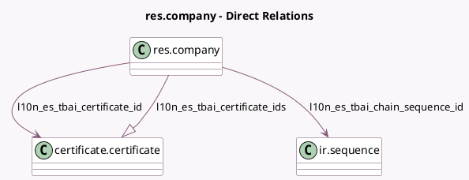

<!-- GENERATED:MODEL -->
---
tags: [odoo, community, generated, model]
---

# res.company

- Module: [[docs/Community Addons/l10n_es_edi_tbai/l10n_es_edi_tbai|l10n_es_edi_tbai]]
- Scope: Community Addons
- Defined in module: extension only
- Source files: `models/res_company.py`
- Python classes: `ResCompany`

## Field footprint

- Detected fields: 7
- Field types: `Boolean` x 2, `Html` x 1, `Many2one` x 2, `One2many` x 1, `Selection` x 1
- Relation fields: 3

## Sample fields

- `l10n_es_tbai_certificate_id`: `Many2one` (comodel `certificate.certificate`, compute `_compute_l10n_es_tbai_certificate`, store `True`)
- `l10n_es_tbai_certificate_ids`: `One2many` (comodel `certificate.certificate`)
- `l10n_es_tbai_chain_sequence_id`: `Many2one` (comodel `ir.sequence`)
- `l10n_es_tbai_is_enabled`: `Boolean` (compute `_compute_l10n_es_tbai_is_enabled`)
- `l10n_es_tbai_license_html`: `Html` (compute `_compute_l10n_es_tbai_license_html`)
- `l10n_es_tbai_tax_agency`: `Selection`
- `l10n_es_tbai_test_env`: `Boolean`

## Method hints

- Detected methods: 7
- Action methods: none
- Compute methods: `_compute_l10n_es_tbai_certificate`, `_compute_l10n_es_tbai_is_enabled`, `_compute_l10n_es_tbai_license_html`
- Onchange methods: none

## Direct relation diagram

## Navigation

- **Parent:** [[docs/Community Addons/l10n_es_edi_tbai/Models]]

<!-- GENERATED:MODEL -->
