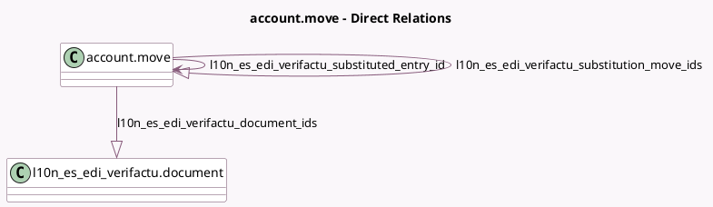

<!-- GENERATED:MODEL -->
---
tags: [odoo, community, generated, model]
---

# account.move

- Module: [[docs/Community Addons/l10n_es_edi_verifactu/l10n_es_edi_verifactu|l10n_es_edi_verifactu]]
- Scope: Community Addons
- Defined in module: extension only
- Source files: `models/account_move.py`
- Python classes: `AccountMove`

## Field footprint

- Detected fields: 12
- Field types: `Boolean` x 2, `Char` x 3, `Html` x 1, `Many2one` x 1, `One2many` x 2, `Selection` x 3
- Relation fields: 3

## Sample fields

- `l10n_es_edi_verifactu_available_clave_regimens`: `Char` (compute `_compute_l10n_es_edi_verifactu_available_clave_regimens`)
- `l10n_es_edi_verifactu_clave_regimen`: `Selection` (compute `_compute_l10n_es_edi_verifactu_clave_regimen`, store `True`)
- `l10n_es_edi_verifactu_document_ids`: `One2many` (comodel `l10n_es_edi_verifactu.document`)
- `l10n_es_edi_verifactu_qr_code`: `Char` (compute `_compute_l10n_es_edi_verifactu_qr_code`)
- `l10n_es_edi_verifactu_refund_reason`: `Selection`
- `l10n_es_edi_verifactu_required`: `Boolean` (related `company_id.l10n_es_edi_verifactu_required`)
- `l10n_es_edi_verifactu_show_cancel_button`: `Boolean` (compute `_compute_l10n_es_edi_verifactu_show_cancel_button`)
- `l10n_es_edi_verifactu_state`: `Selection` (compute `_compute_l10n_es_edi_verifactu_state`, store `True`)
- `l10n_es_edi_verifactu_substituted_entry_id`: `Many2one` (comodel `account.move`)
- `l10n_es_edi_verifactu_substitution_move_ids`: `One2many` (comodel `account.move`)
- `l10n_es_edi_verifactu_warning`: `Html` (compute `_compute_l10n_es_edi_verifactu_warning`)
- `l10n_es_edi_verifactu_warning_level`: `Char` (compute `_compute_l10n_es_edi_verifactu_warning`)

## Method hints

- Detected methods: 17
- Action methods: none
- Compute methods: `_compute_l10n_es_edi_verifactu_available_clave_regimens`, `_compute_l10n_es_edi_verifactu_clave_regimen`, `_compute_l10n_es_edi_verifactu_qr_code`, `_compute_l10n_es_edi_verifactu_show_cancel_button`, `_compute_l10n_es_edi_verifactu_state`, `_compute_l10n_es_edi_verifactu_warning`, `_compute_show_reset_to_draft_button`
- Onchange methods: none

## Direct relation diagram

## Navigation

- **Parent:** [[docs/Community Addons/l10n_es_edi_verifactu/Models]]

<!-- GENERATED:MODEL -->
