<!-- GENERATED:MODEL -->
---
tags: [odoo, community, generated, model]
---

# l10n_es_edi_verifactu.document

- Module: [[docs/Community Addons/l10n_es_edi_verifactu/l10n_es_edi_verifactu|l10n_es_edi_verifactu]]
- Scope: Community Addons
- Defined in module: yes
- Source files: `models/verifactu_document.py`
- Python classes: `L10nEsEdiVerifactuDocument`
- Description: Veri*Factu Document

## Field footprint

- Detected fields: 10
- Field types: `Binary` x 1, `Char` x 2, `Html` x 1, `Integer` x 1, `Many2one` x 3, `Selection` x 2
- Relation fields: 3

## Sample fields

- `chain_index`: `Integer`
- `company_id`: `Many2one` (comodel `res.company`)
- `document_type`: `Selection`
- `errors`: `Html`
- `json_attachment_base64`: `Binary` (related `json_attachment_id.datas`)
- `json_attachment_filename`: `Char` (compute `_compute_json_attachment_filename`)
- `json_attachment_id`: `Many2one` (comodel `ir.attachment`)
- `move_id`: `Many2one` (comodel `account.move`)
- `response_csv`: `Char`
- `state`: `Selection`

## Method hints

- Detected methods: 31
- Action methods: none
- Compute methods: `_compute_display_name`, `_compute_json_attachment_filename`
- Onchange methods: none

## Direct relation diagram

```plantuml
@startuml
!define ODOO_COLOR_PRIMARY #714B67
!define ODOO_COLOR_ACCENT #875A7B
!define ODOO_COLOR_BG #FAF7FA

skinparam backgroundColor ODOO_COLOR_BG
skinparam defaultTextAlignment left
skinparam ArrowColor ODOO_COLOR_ACCENT
skinparam ClassBackgroundColor white
skinparam ClassBorderColor ODOO_COLOR_PRIMARY
skinparam ComponentBackgroundColor white
skinparam ComponentBorderColor ODOO_COLOR_PRIMARY
skinparam NoteBackgroundColor #FFF8FF
skinparam NoteBorderColor ODOO_COLOR_ACCENT
skinparam SequenceLifeLineBorderColor ODOO_COLOR_ACCENT
skinparam SequenceLifeLineBackgroundColor #FFFFFF
skinparam SequenceParticipantBorderColor ODOO_COLOR_PRIMARY
skinparam SequenceParticipantBackgroundColor #FFFFFF
skinparam sequence {
  ArrowColor ODOO_COLOR_ACCENT
  ActorBorderColor ODOO_COLOR_PRIMARY
}
title l10n_es_edi_verifactu.document - Direct Relations
class "l10n_es_edi_verifactu.document" as l10n_es_edi_verifactu_document
class "account.move" as account_move
class "ir.attachment" as ir_attachment
class "res.company" as res_company
l10n_es_edi_verifactu_document --> res_company : company_id
l10n_es_edi_verifactu_document --> account_move : move_id
l10n_es_edi_verifactu_document --> ir_attachment : json_attachment_id
@enduml
```

## Navigation

- **Parent:** [[docs/Community Addons/l10n_es_edi_verifactu/Models]]

<!-- GENERATED:MODEL -->
