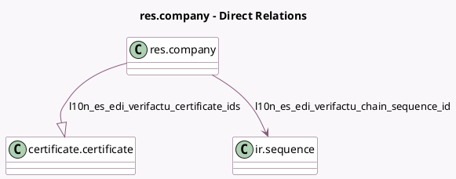

<!-- GENERATED:MODEL -->
---
tags: [odoo, community, generated, model]
---

# res.company

- Module: [[docs/Community Addons/l10n_es_edi_verifactu/l10n_es_edi_verifactu|l10n_es_edi_verifactu]]
- Scope: Community Addons
- Defined in module: extension only
- Source files: `models/res_company.py`
- Python classes: `ResCompany`

## Field footprint

- Detected fields: 6
- Field types: `Boolean` x 2, `Datetime` x 1, `Many2one` x 1, `One2many` x 1, `Selection` x 1
- Relation fields: 2

## Sample fields

- `l10n_es_edi_verifactu_certificate_ids`: `One2many` (comodel `certificate.certificate`)
- `l10n_es_edi_verifactu_chain_sequence_id`: `Many2one` (comodel `ir.sequence`)
- `l10n_es_edi_verifactu_next_batch_time`: `Datetime`
- `l10n_es_edi_verifactu_required`: `Boolean`
- `l10n_es_edi_verifactu_special_vat_regime`: `Selection`
- `l10n_es_edi_verifactu_test_environment`: `Boolean`

## Method hints

- Detected methods: 4
- Action methods: none
- Compute methods: none
- Onchange methods: none

## Direct relation diagram

## Navigation

- **Parent:** [[docs/Community Addons/l10n_es_edi_verifactu/Models]]

<!-- GENERATED:MODEL -->
