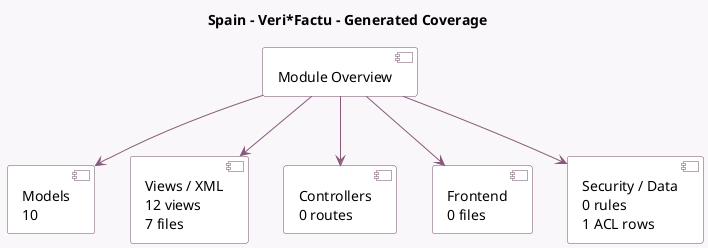

<!-- GENERATED:MODULE -->
---
tags: [odoo, community, module]
---

# Spain - Veri*Factu

- Scope: Community Addons
- Source: odoo/addons/l10n_es_edi_verifactu
- Dependencies: [[docs/Community Addons/l10n_es/l10n_es|l10n_es]]

## Summary

Module for sending Spanish Veri*Factu XML to the AEAT

## Generated coverage

- Models: 10
- XML files with UI/data artifacts: 7
- Views: 12
- Actions: 1
- Menus: 2
- Rules (ir.rule): 0
- Access CSV entries: 1
- Controller units: 0
- Frontend asset files: 0

## Module map

## Detail notes

- Models: [[docs/Community Addons/l10n_es_edi_verifactu/Models|Models]] (10)
- Views and XML: [[docs/Community Addons/l10n_es_edi_verifactu/Views|Views]] (7 files)

## Key models

- `account.chart.template`
- `account.move`
- `account.move.reversal`
- `account.move.send`
- `account.tax`
- `certificate.certificate`
- `l10n_es_edi_verifactu.document`
- `res.company`
- `res.config.settings`
- `res.partner`

## Navigation

- [[../Community Addons/Community Addons|Back to scope]]
- [[../../docs/docs|Back to docs]]

<!-- GENERATED:MODULE -->

