<!-- GENERATED:MODEL -->
---
tags: [odoo, community, generated, model]
---

# pos.order

- Module: [[docs/Community Addons/l10n_es_edi_verifactu_pos/l10n_es_edi_verifactu_pos|l10n_es_edi_verifactu_pos]]
- Scope: Community Addons
- Defined in module: extension only
- Source files: `models/pos_order.py`
- Python classes: `PosOrder`

## Field footprint

- Detected fields: 7
- Field types: `Boolean` x 1, `Char` x 2, `Html` x 1, `One2many` x 1, `Selection` x 2
- Relation fields: 1

## Sample fields

- `l10n_es_edi_verifactu_document_ids`: `One2many` (comodel `l10n_es_edi_verifactu.document`)
- `l10n_es_edi_verifactu_qr_code`: `Char` (compute `_compute_l10n_es_edi_verifactu_qr_code`)
- `l10n_es_edi_verifactu_refund_reason`: `Selection`
- `l10n_es_edi_verifactu_required`: `Boolean` (related `company_id.l10n_es_edi_verifactu_required`)
- `l10n_es_edi_verifactu_state`: `Selection` (compute `_compute_l10n_es_edi_verifactu_state`, store `True`)
- `l10n_es_edi_verifactu_warning`: `Html` (compute `_compute_l10n_es_edi_verifactu_warning`)
- `l10n_es_edi_verifactu_warning_level`: `Char` (compute `_compute_l10n_es_edi_verifactu_warning`)

## Method hints

- Detected methods: 15
- Action methods: `action_pos_order_paid`
- Compute methods: `_compute_l10n_es_edi_verifactu_qr_code`, `_compute_l10n_es_edi_verifactu_state`, `_compute_l10n_es_edi_verifactu_warning`
- Onchange methods: none

## Direct relation diagram

```plantuml
@startuml
!define ODOO_COLOR_PRIMARY #714B67
!define ODOO_COLOR_ACCENT #875A7B
!define ODOO_COLOR_BG #FAF7FA

skinparam backgroundColor ODOO_COLOR_BG
skinparam defaultTextAlignment left
skinparam ArrowColor ODOO_COLOR_ACCENT
skinparam ClassBackgroundColor white
skinparam ClassBorderColor ODOO_COLOR_PRIMARY
skinparam ComponentBackgroundColor white
skinparam ComponentBorderColor ODOO_COLOR_PRIMARY
skinparam NoteBackgroundColor #FFF8FF
skinparam NoteBorderColor ODOO_COLOR_ACCENT
skinparam SequenceLifeLineBorderColor ODOO_COLOR_ACCENT
skinparam SequenceLifeLineBackgroundColor #FFFFFF
skinparam SequenceParticipantBorderColor ODOO_COLOR_PRIMARY
skinparam SequenceParticipantBackgroundColor #FFFFFF
skinparam sequence {
  ArrowColor ODOO_COLOR_ACCENT
  ActorBorderColor ODOO_COLOR_PRIMARY
}
title pos.order - Direct Relations
class "pos.order" as pos_order
class "l10n_es_edi_verifactu.document" as l10n_es_edi_verifactu_document
pos_order --|> l10n_es_edi_verifactu_document : l10n_es_edi_verifactu_document_ids
@enduml
```

## Navigation

- **Parent:** [[docs/Community Addons/l10n_es_edi_verifactu_pos/Models]]

<!-- GENERATED:MODEL -->
