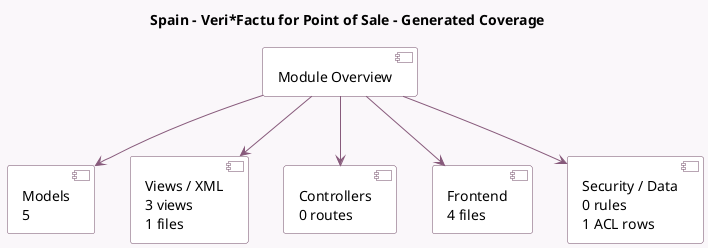

<!-- GENERATED:MODULE -->
---
tags: [odoo, community, module]
---

# Spain - Veri*Factu for Point of Sale

- Scope: Community Addons
- Source: odoo/addons/l10n_es_edi_verifactu_pos
- Dependencies: [[docs/Community Addons/l10n_es_edi_verifactu/l10n_es_edi_verifactu|l10n_es_edi_verifactu]], [[docs/Community Addons/point_of_sale/point_of_sale|point_of_sale]]

## Summary

Add Veri*Factu support to Point of Sale

## Generated coverage

- Models: 5
- XML files with UI/data artifacts: 1
- Views: 3
- Actions: 0
- Menus: 0
- Rules (ir.rule): 0
- Access CSV entries: 1
- Controller units: 0
- Frontend asset files: 4

## Module map

## Detail notes

- Models: [[docs/Community Addons/l10n_es_edi_verifactu_pos/Models|Models]] (5)
- Views and XML: [[docs/Community Addons/l10n_es_edi_verifactu_pos/Views|Views]] (1 files)
- Frontend: [[docs/Community Addons/l10n_es_edi_verifactu_pos/Frontend|Frontend]] (4 files)

## Key models

- `account.move`
- `l10n_es_edi_verifactu.document`
- `pos.config`
- `pos.order`
- `res.company`

## Navigation

- [[../Community Addons/Community Addons|Back to scope]]
- [[../../docs/docs|Back to docs]]

<!-- GENERATED:MODULE -->

