<!-- GENERATED:MODEL -->
---
tags: [odoo, community, generated, model]
---

# pos.config

- Module: [[docs/Community Addons/l10n_es_pos/l10n_es_pos|l10n_es_pos]]
- Scope: Community Addons
- Defined in module: extension only
- Source files: `models/pos_config.py`
- Python classes: `PosConfig`

## Field footprint

- Detected fields: 3
- Field types: `Boolean` x 1, `Many2one` x 2
- Relation fields: 2

## Sample fields

- `is_spanish`: `Boolean` (compute `_compute_is_spanish`)
- `l10n_es_simplified_invoice_journal_id`: `Many2one` (comodel `account.journal`)
- `simplified_partner_id`: `Many2one` (comodel `res.partner`, compute `_compute_simplified_partner_id`)

## Method hints

- Detected methods: 3
- Action methods: none
- Compute methods: `_compute_is_spanish`, `_compute_simplified_partner_id`
- Onchange methods: none

## Direct relation diagram

```plantuml
@startuml
!define ODOO_COLOR_PRIMARY #714B67
!define ODOO_COLOR_ACCENT #875A7B
!define ODOO_COLOR_BG #FAF7FA

skinparam backgroundColor ODOO_COLOR_BG
skinparam defaultTextAlignment left
skinparam ArrowColor ODOO_COLOR_ACCENT
skinparam ClassBackgroundColor white
skinparam ClassBorderColor ODOO_COLOR_PRIMARY
skinparam ComponentBackgroundColor white
skinparam ComponentBorderColor ODOO_COLOR_PRIMARY
skinparam NoteBackgroundColor #FFF8FF
skinparam NoteBorderColor ODOO_COLOR_ACCENT
skinparam SequenceLifeLineBorderColor ODOO_COLOR_ACCENT
skinparam SequenceLifeLineBackgroundColor #FFFFFF
skinparam SequenceParticipantBorderColor ODOO_COLOR_PRIMARY
skinparam SequenceParticipantBackgroundColor #FFFFFF
skinparam sequence {
  ArrowColor ODOO_COLOR_ACCENT
  ActorBorderColor ODOO_COLOR_PRIMARY
}
title pos.config - Direct Relations
class "pos.config" as pos_config
class "account.journal" as account_journal
class "res.partner" as res_partner
pos_config --> account_journal : l10n_es_simplified_invoice_journal_id
pos_config --> res_partner : simplified_partner_id
@enduml
```

## Navigation

- **Parent:** [[docs/Community Addons/l10n_es_pos/Models]]

<!-- GENERATED:MODEL -->
