<!-- GENERATED:MODEL -->
---
tags: [odoo, community, generated, model]
---

# l10n_fr.fec.export.wizard

- Module: [[docs/Community Addons/l10n_fr_account/l10n_fr_account|l10n_fr_account]]
- Scope: Community Addons
- Defined in module: yes
- Source files: `wizard/account_fr_fec_export_wizard.py`
- Python classes: `L10n_FrFecExportWizard`
- Description: Fichier Echange Informatise

## Field footprint

- Detected fields: 6
- Field types: `Boolean` x 1, `Char` x 1, `Date` x 2, `Many2many` x 1, `Selection` x 1
- Relation fields: 1

## Sample fields

- `date_from`: `Date`
- `date_to`: `Date`
- `excluded_journal_ids`: `Many2many` (comodel `account.journal`)
- `export_type`: `Selection`
- `filename`: `Char`
- `test_file`: `Boolean`

## Method hints

- Detected methods: 6
- Action methods: none
- Compute methods: none
- Onchange methods: `_onchange_export_file`

## Direct relation diagram

```plantuml
@startuml
!define ODOO_COLOR_PRIMARY #714B67
!define ODOO_COLOR_ACCENT #875A7B
!define ODOO_COLOR_BG #FAF7FA

skinparam backgroundColor ODOO_COLOR_BG
skinparam defaultTextAlignment left
skinparam ArrowColor ODOO_COLOR_ACCENT
skinparam ClassBackgroundColor white
skinparam ClassBorderColor ODOO_COLOR_PRIMARY
skinparam ComponentBackgroundColor white
skinparam ComponentBorderColor ODOO_COLOR_PRIMARY
skinparam NoteBackgroundColor #FFF8FF
skinparam NoteBorderColor ODOO_COLOR_ACCENT
skinparam SequenceLifeLineBorderColor ODOO_COLOR_ACCENT
skinparam SequenceLifeLineBackgroundColor #FFFFFF
skinparam SequenceParticipantBorderColor ODOO_COLOR_PRIMARY
skinparam SequenceParticipantBackgroundColor #FFFFFF
skinparam sequence {
  ArrowColor ODOO_COLOR_ACCENT
  ActorBorderColor ODOO_COLOR_PRIMARY
}
title l10n_fr.fec.export.wizard - Direct Relations
class "l10n_fr.fec.export.wizard" as l10n_fr_fec_export_wizard
class "account.journal" as account_journal
l10n_fr_fec_export_wizard .. account_journal : excluded_journal_ids
@enduml
```

## Navigation

- **Parent:** [[docs/Community Addons/l10n_fr_account/Models]]

<!-- GENERATED:MODEL -->
