<!-- GENERATED:MODEL -->
---
tags: [odoo, community, generated, model]
---

# account.sale.closing

- Module: [[docs/Community Addons/l10n_fr_pos_cert/l10n_fr_pos_cert|l10n_fr_pos_cert]]
- Scope: Community Addons
- Defined in module: yes
- Source files: `models/account_closing.py`
- Python classes: `AccountSaleClosing`
- Description: Sale Closing

## Field footprint

- Detected fields: 11
- Field types: `Char` x 2, `Datetime` x 2, `Integer` x 1, `Many2one` x 3, `Monetary` x 2, `Selection` x 1
- Relation fields: 3

## Sample fields

- `company_id`: `Many2one` (comodel `res.company`)
- `cumulative_total`: `Monetary`
- `currency_id`: `Many2one` (comodel `res.currency`, related `company_id.currency_id`, store `True`)
- `date_closing_start`: `Datetime`
- `date_closing_stop`: `Datetime`
- `frequency`: `Selection`
- `last_order_hash`: `Char`
- `last_order_id`: `Many2one` (comodel `pos.order`)
- `name`: `Char`
- `sequence_number`: `Integer` (comodel `Sequence #`)
- `total_interval`: `Monetary`

## Method hints

- Detected methods: 6
- Action methods: none
- Compute methods: `_compute_amounts`
- Onchange methods: none

## Direct relation diagram

```plantuml
@startuml
!define ODOO_COLOR_PRIMARY #714B67
!define ODOO_COLOR_ACCENT #875A7B
!define ODOO_COLOR_BG #FAF7FA

skinparam backgroundColor ODOO_COLOR_BG
skinparam defaultTextAlignment left
skinparam ArrowColor ODOO_COLOR_ACCENT
skinparam ClassBackgroundColor white
skinparam ClassBorderColor ODOO_COLOR_PRIMARY
skinparam ComponentBackgroundColor white
skinparam ComponentBorderColor ODOO_COLOR_PRIMARY
skinparam NoteBackgroundColor #FFF8FF
skinparam NoteBorderColor ODOO_COLOR_ACCENT
skinparam SequenceLifeLineBorderColor ODOO_COLOR_ACCENT
skinparam SequenceLifeLineBackgroundColor #FFFFFF
skinparam SequenceParticipantBorderColor ODOO_COLOR_PRIMARY
skinparam SequenceParticipantBackgroundColor #FFFFFF
skinparam sequence {
  ArrowColor ODOO_COLOR_ACCENT
  ActorBorderColor ODOO_COLOR_PRIMARY
}
title account.sale.closing - Direct Relations
class "account.sale.closing" as account_sale_closing
class "pos.order" as pos_order
class "res.company" as res_company
class "res.currency" as res_currency
account_sale_closing --> res_company : company_id
account_sale_closing --> pos_order : last_order_id
account_sale_closing --> res_currency : currency_id
@enduml
```

## Navigation

- **Parent:** [[docs/Community Addons/l10n_fr_pos_cert/Models]]

<!-- GENERATED:MODEL -->
