<!-- GENERATED:MODEL -->
---
tags: [odoo, community, generated, model]
---

# pos.order

- Module: [[docs/Community Addons/l10n_fr_pos_cert/l10n_fr_pos_cert|l10n_fr_pos_cert]]
- Scope: Community Addons
- Defined in module: extension only
- Source files: `models/pos.py`
- Python classes: `PosOrder`

## Field footprint

- Detected fields: 5
- Field types: `Char` x 3, `Integer` x 1, `Many2one` x 1
- Relation fields: 1

## Sample fields

- `l10n_fr_hash`: `Char`
- `l10n_fr_secure_sequence_number`: `Integer`
- `l10n_fr_string_to_hash`: `Char` (compute `_compute_string_to_hash`, store `False`)
- `pos_version`: `Char`
- `previous_order_id`: `Many2one` (comodel `pos.order`, compute `_compute_previous_order`, store `True`)

## Method hints

- Detected methods: 7
- Action methods: none
- Compute methods: `_compute_hash`, `_compute_previous_order`, `_compute_string_to_hash`
- Onchange methods: none

## Direct relation diagram

```plantuml
@startuml
!define ODOO_COLOR_PRIMARY #714B67
!define ODOO_COLOR_ACCENT #875A7B
!define ODOO_COLOR_BG #FAF7FA

skinparam backgroundColor ODOO_COLOR_BG
skinparam defaultTextAlignment left
skinparam ArrowColor ODOO_COLOR_ACCENT
skinparam ClassBackgroundColor white
skinparam ClassBorderColor ODOO_COLOR_PRIMARY
skinparam ComponentBackgroundColor white
skinparam ComponentBorderColor ODOO_COLOR_PRIMARY
skinparam NoteBackgroundColor #FFF8FF
skinparam NoteBorderColor ODOO_COLOR_ACCENT
skinparam SequenceLifeLineBorderColor ODOO_COLOR_ACCENT
skinparam SequenceLifeLineBackgroundColor #FFFFFF
skinparam SequenceParticipantBorderColor ODOO_COLOR_PRIMARY
skinparam SequenceParticipantBackgroundColor #FFFFFF
skinparam sequence {
  ArrowColor ODOO_COLOR_ACCENT
  ActorBorderColor ODOO_COLOR_PRIMARY
}
title pos.order - Direct Relations
class "pos.order" as pos_order
class "pos.order" as pos_order
pos_order --> pos_order : previous_order_id
@enduml
```

## Navigation

- **Parent:** [[docs/Community Addons/l10n_fr_pos_cert/Models]]

<!-- GENERATED:MODEL -->
