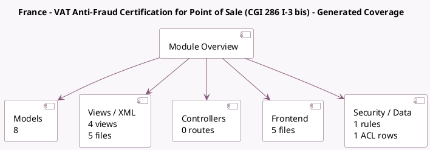

<!-- GENERATED:MODULE -->
---
tags: [odoo, community, module]
---

# France - VAT Anti-Fraud Certification for Point of Sale (CGI 286 I-3 bis)

- Scope: Community Addons
- Source: odoo/addons/l10n_fr_pos_cert
- Dependencies: [[docs/Community Addons/l10n_fr_account/l10n_fr_account|l10n_fr_account]], [[docs/Community Addons/point_of_sale/point_of_sale|point_of_sale]]

## Generated coverage

- Models: 8
- XML files with UI/data artifacts: 5
- Views: 4
- Actions: 3
- Menus: 4
- Rules (ir.rule): 1
- Access CSV entries: 1
- Controller units: 0
- Frontend asset files: 5

## Module map

## Detail notes

- Models: [[docs/Community Addons/l10n_fr_pos_cert/Models|Models]] (8)
- Views and XML: [[docs/Community Addons/l10n_fr_pos_cert/Views|Views]] (5 files)
- Frontend: [[docs/Community Addons/l10n_fr_pos_cert/Frontend|Frontend]] (5 files)

## Key models

- `account.fiscal.position`
- `account.sale.closing`
- `pos.config`
- `pos.order`
- `pos.order.line`
- `pos.session`
- `report.l10n_fr_pos_cert.report_pos_hash_integrity`
- `res.company`

## Navigation

- [[../Community Addons/Community Addons|Back to scope]]
- [[../../docs/docs|Back to docs]]

<!-- GENERATED:MODULE -->

