<!-- GENERATED:MODEL -->
---
tags: [odoo, community, generated, model]
---

# l10n_gr_edi.preferred_classification

- Module: [[docs/Community Addons/l10n_gr_edi/l10n_gr_edi|l10n_gr_edi]]
- Scope: Community Addons
- Defined in module: yes
- Source files: `models/preferred_classification.py`
- Python classes: `PreferredClassification`
- Description: Preferred myDATA classification combinations for a particular product

## Field footprint

- Detected fields: 9
- Field types: `Char` x 3, `Integer` x 1, `Many2one` x 2, `Selection` x 3
- Relation fields: 2

## Sample fields

- `fiscal_position_id`: `Many2one` (comodel `account.fiscal.position`)
- `l10n_gr_edi_available_cls_category`: `Char` (compute `_compute_l10n_gr_edi_available_cls_category`)
- `l10n_gr_edi_available_cls_type`: `Char` (compute `_compute_l10n_gr_edi_available_cls_type`)
- `l10n_gr_edi_available_inv_type`: `Char`
- `l10n_gr_edi_cls_category`: `Selection`
- `l10n_gr_edi_cls_type`: `Selection`
- `l10n_gr_edi_inv_type`: `Selection`
- `priority`: `Integer`
- `product_template_id`: `Many2one` (comodel `product.template`)

## Method hints

- Detected methods: 7
- Action methods: none
- Compute methods: `_compute_l10n_gr_edi_available_cls_category`, `_compute_l10n_gr_edi_available_cls_type`
- Onchange methods: `_onchange_reset_cls_category`, `_onchange_reset_cls_type`

## Direct relation diagram

```plantuml
@startuml
!define ODOO_COLOR_PRIMARY #714B67
!define ODOO_COLOR_ACCENT #875A7B
!define ODOO_COLOR_BG #FAF7FA

skinparam backgroundColor ODOO_COLOR_BG
skinparam defaultTextAlignment left
skinparam ArrowColor ODOO_COLOR_ACCENT
skinparam ClassBackgroundColor white
skinparam ClassBorderColor ODOO_COLOR_PRIMARY
skinparam ComponentBackgroundColor white
skinparam ComponentBorderColor ODOO_COLOR_PRIMARY
skinparam NoteBackgroundColor #FFF8FF
skinparam NoteBorderColor ODOO_COLOR_ACCENT
skinparam SequenceLifeLineBorderColor ODOO_COLOR_ACCENT
skinparam SequenceLifeLineBackgroundColor #FFFFFF
skinparam SequenceParticipantBorderColor ODOO_COLOR_PRIMARY
skinparam SequenceParticipantBackgroundColor #FFFFFF
skinparam sequence {
  ArrowColor ODOO_COLOR_ACCENT
  ActorBorderColor ODOO_COLOR_PRIMARY
}
title l10n_gr_edi.preferred_classification - Direct Relations
class "l10n_gr_edi.preferred_classification" as l10n_gr_edi_preferred_classification
class "account.fiscal.position" as account_fiscal_position
class "product.template" as product_template
l10n_gr_edi_preferred_classification --> product_template : product_template_id
l10n_gr_edi_preferred_classification --> account_fiscal_position : fiscal_position_id
@enduml
```

## Navigation

- **Parent:** [[docs/Community Addons/l10n_gr_edi/Models]]

<!-- GENERATED:MODEL -->
