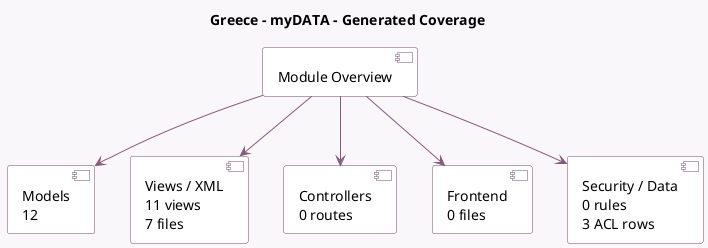

<!-- GENERATED:MODULE -->
---
tags: [odoo, community, module]
---

# Greece - myDATA

- Scope: Community Addons
- Source: odoo/addons/l10n_gr_edi
- Dependencies: [[docs/Community Addons/l10n_gr/l10n_gr|l10n_gr]]

## Summary

Connect to myDATA API implementation for Greece

## Generated coverage

- Models: 12
- XML files with UI/data artifacts: 7
- Views: 11
- Actions: 1
- Menus: 0
- Rules (ir.rule): 0
- Access CSV entries: 3
- Controller units: 0
- Frontend asset files: 0

## Module map

## Detail notes

- Models: [[docs/Community Addons/l10n_gr_edi/Models|Models]] (12)
- Views and XML: [[docs/Community Addons/l10n_gr_edi/Views|Views]] (7 files)

## Key models

- `account.fiscal.position`
- `account.move`
- `account.move.line`
- `account.move.reversal`
- `account.move.send`
- `account.tax`
- `l10n_gr_edi.document`
- `l10n_gr_edi.preferred_classification`
- `product.template`
- `res.company`
- `res.config.settings`
- `res.partner`

## Navigation

- [[../Community Addons/Community Addons|Back to scope]]
- [[../../docs/docs|Back to docs]]

<!-- GENERATED:MODULE -->

