<!-- GENERATED:MODEL -->
---
tags: [odoo, community, generated, model]
---

# l10n_hu_edi.cancellation

- Module: [[docs/Community Addons/l10n_hu_edi/l10n_hu_edi|l10n_hu_edi]]
- Scope: Community Addons
- Defined in module: yes
- Source files: `wizard/l10n_hu_edi_cancellation.py`
- Python classes: `L10n_Hu_EdiCancellation`
- Description: Technical Annulment Wizard

## Field footprint

- Detected fields: 3
- Field types: `Char` x 1, `Many2one` x 1, `Selection` x 1
- Relation fields: 1

## Sample fields

- `code`: `Selection`
- `invoice_id`: `Many2one` (comodel `account.move`)
- `reason`: `Char`

## Method hints

- Detected methods: 1
- Action methods: none
- Compute methods: none
- Onchange methods: none

## Direct relation diagram

```plantuml
@startuml
!define ODOO_COLOR_PRIMARY #714B67
!define ODOO_COLOR_ACCENT #875A7B
!define ODOO_COLOR_BG #FAF7FA

skinparam backgroundColor ODOO_COLOR_BG
skinparam defaultTextAlignment left
skinparam ArrowColor ODOO_COLOR_ACCENT
skinparam ClassBackgroundColor white
skinparam ClassBorderColor ODOO_COLOR_PRIMARY
skinparam ComponentBackgroundColor white
skinparam ComponentBorderColor ODOO_COLOR_PRIMARY
skinparam NoteBackgroundColor #FFF8FF
skinparam NoteBorderColor ODOO_COLOR_ACCENT
skinparam SequenceLifeLineBorderColor ODOO_COLOR_ACCENT
skinparam SequenceLifeLineBackgroundColor #FFFFFF
skinparam SequenceParticipantBorderColor ODOO_COLOR_PRIMARY
skinparam SequenceParticipantBackgroundColor #FFFFFF
skinparam sequence {
  ArrowColor ODOO_COLOR_ACCENT
  ActorBorderColor ODOO_COLOR_PRIMARY
}
title l10n_hu_edi.cancellation - Direct Relations
class "l10n_hu_edi.cancellation" as l10n_hu_edi_cancellation
class "account.move" as account_move
l10n_hu_edi_cancellation --> account_move : invoice_id
@enduml
```

## Navigation

- **Parent:** [[docs/Community Addons/l10n_hu_edi/Models]]

<!-- GENERATED:MODEL -->
