<!-- GENERATED:MODEL -->
---
tags: [odoo, community, generated, model]
---

# l10n_id.qris.transaction

- Module: [[docs/Community Addons/l10n_id/l10n_id|l10n_id]]
- Scope: Community Addons
- Defined in module: yes
- Source files: `models/qris_transaction.py`
- Python classes: `L10n_IdQrisTransaction`
- Description: Record of QRIS transactions

## Field footprint

- Detected fields: 8
- Field types: `Boolean` x 1, `Char` x 4, `Datetime` x 1, `Integer` x 1, `Many2one` x 1
- Relation fields: 1

## Sample fields

- `bank_id`: `Many2one` (comodel `res.partner.bank`)
- `model`: `Char`
- `model_id`: `Char`
- `paid`: `Boolean`
- `qris_amount`: `Integer`
- `qris_content`: `Char`
- `qris_creation_datetime`: `Datetime`
- `qris_invoice_id`: `Char`

## Method hints

- Detected methods: 6
- Action methods: none
- Compute methods: none
- Onchange methods: none

## Direct relation diagram

```plantuml
@startuml
!define ODOO_COLOR_PRIMARY #714B67
!define ODOO_COLOR_ACCENT #875A7B
!define ODOO_COLOR_BG #FAF7FA

skinparam backgroundColor ODOO_COLOR_BG
skinparam defaultTextAlignment left
skinparam ArrowColor ODOO_COLOR_ACCENT
skinparam ClassBackgroundColor white
skinparam ClassBorderColor ODOO_COLOR_PRIMARY
skinparam ComponentBackgroundColor white
skinparam ComponentBorderColor ODOO_COLOR_PRIMARY
skinparam NoteBackgroundColor #FFF8FF
skinparam NoteBorderColor ODOO_COLOR_ACCENT
skinparam SequenceLifeLineBorderColor ODOO_COLOR_ACCENT
skinparam SequenceLifeLineBackgroundColor #FFFFFF
skinparam SequenceParticipantBorderColor ODOO_COLOR_PRIMARY
skinparam SequenceParticipantBackgroundColor #FFFFFF
skinparam sequence {
  ArrowColor ODOO_COLOR_ACCENT
  ActorBorderColor ODOO_COLOR_PRIMARY
}
title l10n_id.qris.transaction - Direct Relations
class "l10n_id.qris.transaction" as l10n_id_qris_transaction
class "res.partner.bank" as res_partner_bank
l10n_id_qris_transaction --> res_partner_bank : bank_id
@enduml
```

## Navigation

- **Parent:** [[docs/Community Addons/l10n_id/Models]]

<!-- GENERATED:MODEL -->
