<!-- GENERATED:MODEL -->
---
tags: [odoo, community, generated, model]
---

# account.move

- Module: [[docs/Community Addons/l10n_id_efaktur_coretax/l10n_id_efaktur_coretax|l10n_id_efaktur_coretax]]
- Scope: Community Addons
- Defined in module: extension only
- Source files: `models/account_move.py`
- Python classes: `AccountMove`

## Field footprint

- Detected fields: 9
- Field types: `Boolean` x 1, `Char` x 1, `Date` x 1, `Many2one` x 1, `Selection` x 5
- Relation fields: 1

## Sample fields

- `l10n_id_coretax_add_info_07`: `Selection` (compute `_compute_l10n_id_coretax_add_info`, store `True`)
- `l10n_id_coretax_add_info_08`: `Selection` (compute `_compute_l10n_id_coretax_add_info`, store `True`)
- `l10n_id_coretax_custom_doc`: `Char`
- `l10n_id_coretax_custom_doc_month_year`: `Date`
- `l10n_id_coretax_document`: `Many2one` (comodel `l10n_id_efaktur_coretax.document`)
- `l10n_id_coretax_efaktur_available`: `Boolean` (compute `_compute_l10n_id_coretax_efaktur_available`)
- `l10n_id_coretax_facility_info_07`: `Selection` (compute `_compute_l10n_id_coretax_facility_info`, store `True`)
- `l10n_id_coretax_facility_info_08`: `Selection` (compute `_compute_l10n_id_coretax_facility_info`, store `True`)
- `l10n_id_kode_transaksi`: `Selection` (compute `_compute_kode_transaksi`, store `True`)

## Method hints

- Detected methods: 9
- Action methods: none
- Compute methods: `_compute_kode_transaksi`, `_compute_l10n_id_coretax_add_info`, `_compute_l10n_id_coretax_efaktur_available`, `_compute_l10n_id_coretax_facility_info`
- Onchange methods: none

## Direct relation diagram

```plantuml
@startuml
!define ODOO_COLOR_PRIMARY #714B67
!define ODOO_COLOR_ACCENT #875A7B
!define ODOO_COLOR_BG #FAF7FA

skinparam backgroundColor ODOO_COLOR_BG
skinparam defaultTextAlignment left
skinparam ArrowColor ODOO_COLOR_ACCENT
skinparam ClassBackgroundColor white
skinparam ClassBorderColor ODOO_COLOR_PRIMARY
skinparam ComponentBackgroundColor white
skinparam ComponentBorderColor ODOO_COLOR_PRIMARY
skinparam NoteBackgroundColor #FFF8FF
skinparam NoteBorderColor ODOO_COLOR_ACCENT
skinparam SequenceLifeLineBorderColor ODOO_COLOR_ACCENT
skinparam SequenceLifeLineBackgroundColor #FFFFFF
skinparam SequenceParticipantBorderColor ODOO_COLOR_PRIMARY
skinparam SequenceParticipantBackgroundColor #FFFFFF
skinparam sequence {
  ArrowColor ODOO_COLOR_ACCENT
  ActorBorderColor ODOO_COLOR_PRIMARY
}
title account.move - Direct Relations
class "account.move" as account_move
class "l10n_id_efaktur_coretax.document" as l10n_id_efaktur_coretax_document
account_move --> l10n_id_efaktur_coretax_document : l10n_id_coretax_document
@enduml
```

## Navigation

- **Parent:** [[docs/Community Addons/l10n_id_efaktur_coretax/Models]]

<!-- GENERATED:MODEL -->
