<!-- GENERATED:MODEL -->
---
tags: [odoo, community, generated, model]
---

# l10n_id_efaktur_coretax.document

- Module: [[docs/Community Addons/l10n_id_efaktur_coretax/l10n_id_efaktur_coretax|l10n_id_efaktur_coretax]]
- Scope: Community Addons
- Defined in module: yes
- Source files: `models/efaktur_document.py`
- Python classes: `EfakturDocument`
- Description: E-Faktur Document
- Inherits: `mail.activity.mixin`, `mail.thread.main.attachment`

## Field footprint

- Detected fields: 5
- Field types: `Boolean` x 1, `Char` x 1, `Many2one` x 2, `One2many` x 1
- Relation fields: 3

## Sample fields

- `active`: `Boolean`
- `attachment_id`: `Many2one` (comodel `ir.attachment`)
- `company_id`: `Many2one` (comodel `res.company`)
- `invoice_ids`: `One2many` (comodel `account.move`)
- `name`: `Char` (compute `_compute_name`, store `True`)

## Method hints

- Detected methods: 5
- Action methods: `action_download`, `action_regenerate`
- Compute methods: `_compute_name`
- Onchange methods: none

## Direct relation diagram

```plantuml
@startuml
!define ODOO_COLOR_PRIMARY #714B67
!define ODOO_COLOR_ACCENT #875A7B
!define ODOO_COLOR_BG #FAF7FA

skinparam backgroundColor ODOO_COLOR_BG
skinparam defaultTextAlignment left
skinparam ArrowColor ODOO_COLOR_ACCENT
skinparam ClassBackgroundColor white
skinparam ClassBorderColor ODOO_COLOR_PRIMARY
skinparam ComponentBackgroundColor white
skinparam ComponentBorderColor ODOO_COLOR_PRIMARY
skinparam NoteBackgroundColor #FFF8FF
skinparam NoteBorderColor ODOO_COLOR_ACCENT
skinparam SequenceLifeLineBorderColor ODOO_COLOR_ACCENT
skinparam SequenceLifeLineBackgroundColor #FFFFFF
skinparam SequenceParticipantBorderColor ODOO_COLOR_PRIMARY
skinparam SequenceParticipantBackgroundColor #FFFFFF
skinparam sequence {
  ArrowColor ODOO_COLOR_ACCENT
  ActorBorderColor ODOO_COLOR_PRIMARY
}
title l10n_id_efaktur_coretax.document - Direct Relations
class "l10n_id_efaktur_coretax.document" as l10n_id_efaktur_coretax_document
class "account.move" as account_move
class "ir.attachment" as ir_attachment
class "res.company" as res_company
l10n_id_efaktur_coretax_document --> res_company : company_id
l10n_id_efaktur_coretax_document --|> account_move : invoice_ids
l10n_id_efaktur_coretax_document --> ir_attachment : attachment_id
@enduml
```

## Navigation

- **Parent:** [[docs/Community Addons/l10n_id_efaktur_coretax/Models]]

<!-- GENERATED:MODEL -->
