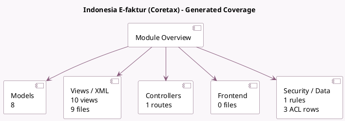

<!-- GENERATED:MODULE -->
---
tags: [odoo, community, module]
---

# Indonesia E-faktur (Coretax)

- Scope: Community Addons
- Source: odoo/addons/l10n_id_efaktur_coretax
- Dependencies: [[docs/Community Addons/l10n_id/l10n_id|l10n_id]]

## Generated coverage

- Models: 8
- XML files with UI/data artifacts: 9
- Views: 10
- Actions: 2
- Menus: 0
- Rules (ir.rule): 1
- Access CSV entries: 3
- Controller units: 1
- Frontend asset files: 0

## Module map

## Detail notes

- Models: [[docs/Community Addons/l10n_id_efaktur_coretax/Models|Models]] (8)
- Views and XML: [[docs/Community Addons/l10n_id_efaktur_coretax/Views|Views]] (9 files)
- Controllers: [[docs/Community Addons/l10n_id_efaktur_coretax/Controllers|Controllers]] (1)

## Key models

- `account.move`
- `account.move.line`
- `l10n_id_efaktur_coretax.document`
- `l10n_id_efaktur_coretax.product.code`
- `l10n_id_efaktur_coretax.uom.code`
- `product.template`
- `res.partner`
- `uom.uom`

## Navigation

- [[../Community Addons/Community Addons|Back to scope]]
- [[../../docs/docs|Back to docs]]

<!-- GENERATED:MODULE -->

