<!-- GENERATED:MODEL -->
---
tags: [odoo, community, generated, model]
---

# account.account

- Module: [[docs/Community Addons/l10n_in/l10n_in|l10n_in]]
- Scope: Community Addons
- Defined in module: extension only
- Source files: `models/account_account.py`
- Python classes: `AccountAccount`

## Field footprint

- Detected fields: 3
- Field types: `Boolean` x 2, `Many2one` x 1
- Relation fields: 1

## Sample fields

- `l10n_in_tcs_feature_enabled`: `Boolean` (compute `_compute_tds_tcs_features`, store `True`)
- `l10n_in_tds_feature_enabled`: `Boolean` (compute `_compute_tds_tcs_features`, store `True`)
- `l10n_in_tds_tcs_section_id`: `Many2one` (comodel `l10n_in.section.alert`)

## Method hints

- Detected methods: 1
- Action methods: none
- Compute methods: `_compute_tds_tcs_features`
- Onchange methods: none

## Direct relation diagram

```plantuml
@startuml
!define ODOO_COLOR_PRIMARY #714B67
!define ODOO_COLOR_ACCENT #875A7B
!define ODOO_COLOR_BG #FAF7FA

skinparam backgroundColor ODOO_COLOR_BG
skinparam defaultTextAlignment left
skinparam ArrowColor ODOO_COLOR_ACCENT
skinparam ClassBackgroundColor white
skinparam ClassBorderColor ODOO_COLOR_PRIMARY
skinparam ComponentBackgroundColor white
skinparam ComponentBorderColor ODOO_COLOR_PRIMARY
skinparam NoteBackgroundColor #FFF8FF
skinparam NoteBorderColor ODOO_COLOR_ACCENT
skinparam SequenceLifeLineBorderColor ODOO_COLOR_ACCENT
skinparam SequenceLifeLineBackgroundColor #FFFFFF
skinparam SequenceParticipantBorderColor ODOO_COLOR_PRIMARY
skinparam SequenceParticipantBackgroundColor #FFFFFF
skinparam sequence {
  ArrowColor ODOO_COLOR_ACCENT
  ActorBorderColor ODOO_COLOR_PRIMARY
}
title account.account - Direct Relations
class "account.account" as account_account
class "l10n_in.section.alert" as l10n_in_section_alert
account_account --> l10n_in_section_alert : l10n_in_tds_tcs_section_id
@enduml
```

## Navigation

- **Parent:** [[docs/Community Addons/l10n_in/Models]]

<!-- GENERATED:MODEL -->
